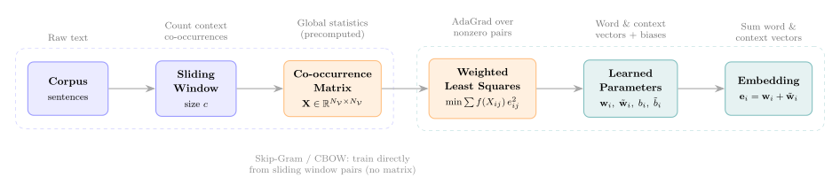

# L10a: GloVe: Learning Word Embeddings from Global Co-occurrence Statistics
In L9a, we built count-based representations (Bag of Words, Term Frequency-Inverse Document Frequency, and Pointwise Mutual Information) that capture corpus-level statistics but produce sparse, high-dimensional vectors. In L9c, we trained the Skip-Gram model, a prediction-based method that learns dense embeddings by predicting context words from a target word. Levy and Goldberg (2014) showed that Skip-Gram with Negative Sampling (SGNS) implicitly factorizes a shifted PMI matrix, revealing a hidden connection between prediction-based and count-based approaches.

Global Vectors for Word Representation (GloVe) makes this connection explicit. Instead of learning embeddings as a byproduct of a prediction task, GloVe directly factorizes a log co-occurrence matrix using a weighted least-squares objective. The result is a model that combines the statistical efficiency of count-based methods with the linear substructure of prediction-based embeddings.

> __Learning Objectives:__
>
> By the end of this lecture, you should be able to:
>
> * __Co-occurrence statistics and probe words__: Define the co-occurrence matrix $X_{ij}$, the conditional co-occurrence probability $P_{ij}$, and the probe-word ratio $P_{ik}/P_{jk}$. Explain how these ratios distinguish words that are associated with one context but not another.
> * __GloVe objective function__: Write the weighted least-squares objective that GloVe minimizes, including the weighting function $f(X_{ij})$, bias terms, and the log co-occurrence target. Describe the role of each component in the objective.
> * __Training and embedding extraction__: Outline how GloVe parameters are updated using gradient-based optimization. Explain why the final embedding for each word is the sum of its word vector and context vector.

Let's get started!
___

## Examples
Today, we will use the following examples to illustrate key concepts:

> [▶ Implement GloVe Embeddings](CHEME-5820-L10a-Example-GloVe-Embeddings-Spring-2026.ipynb). In this example, we build a co-occurrence matrix from a small corpus, train GloVe embeddings using the weighted least-squares objective, and evaluate the learned vectors through cosine similarity and semantic arithmetic.

For the gradient derivation and optimizer details, see the advanced notebook.

> [▶ Advanced: GloVe Gradient Derivation and AdaGrad Optimization](CHEME-5820-L10a-Advanced-GloVe-AdaGrad-Spring-2026.ipynb). This notebook derives the GloVe gradients from first principles and examines why AdaGrad is well-suited to GloVe's sparse co-occurrence structure. We also compare AdaGrad to Adam.

___

The figure below summarizes the GloVe training pipeline, from raw corpus to learned embeddings.

  

    
  

## Co-occurrence Statistics
GloVe starts from a word-word co-occurrence matrix constructed over the entire corpus. Let $\mathcal{V}$ be the vocabulary with $N_{\mathcal{V}} = |\mathcal{V}|$ words. We scan the corpus with a symmetric context window of size $c$ around each center word, accumulating counts into a matrix $\mathbf{X}\in\mathbb{R}^{N_{\mathcal{V}}\times N_{\mathcal{V}}}$.

> __Definition (Co-occurrence count and probability)__
>
> Let $X_{ij}$ denote the number of times word $j$ appears in the context window of word $i$. Optionally, each context occurrence is weighted by the inverse of its distance from the center word, so closer words contribute more. The row sum $X_{i} = \sum_{k\in\mathcal{V}} X_{ik}$ is the total context count for word $i$. The conditional co-occurrence probability is:
> $$
> P_{ij} = \frac{X_{ij}}{X_{i}}
> $$
> which estimates the probability that word $j$ appears in the context of word $i$.

The matrix $P_{ij}$ has a familiar structure: each row sums to 1, so it is a row-stochastic matrix — the same structure as a transition matrix in a Markov chain.

> __Remark (Connection to Markov chains)__
>
> The co-occurrence probability $P_{ij}$ defines a random walk over the vocabulary. From word $i$, the walker moves to word $j$ with probability $P_{ij} = X_{ij}/X_i$. Frequent words act as high-degree hub states that the walk visits often, which is why GloVe needs the weighting function $f(X_{ij})$ to prevent these hubs from dominating training. This Markov perspective makes the probe-word ratio $P_{ik}/P_{jk}$ easier to interpret: it compares the one-step transition probability to probe word $k$ from two different starting states $i$ and $j$.

The key insight of GloVe is that raw probabilities are less informative than their ratios. To see why, consider a probe-word analysis.

> __Definition (Probe-word ratio)__
>
> Given two target words $i$ and $j$ and a probe word $k$, the ratio of co-occurrence probabilities can be expanded in terms of raw counts:
> $$
> \frac{P_{ik}}{P_{jk}} = \frac{X_{ik}\,/\,X_{i}}{X_{jk}\,/\,X_{j}} = \frac{X_{ik}}{X_{jk}}\cdot\left(\frac{X_{j}}{X_{i}}\right)
> $$
> The first factor $X_{ik}/X_{jk}$ (relative association) compares how often probe word $k$ co-occurs with each target: if $X_{ik} \gg X_{jk}$, then $k$ is more strongly associated with word $i$. The second factor $X_{j}/X_{i}$ (frequency correction) corrects for differences in overall frequency between the two target words. Together, the ratio reveals three cases:
>
> * __Large ratio__ ($P_{ik}/P_{jk} \gg 1$): word $k$ co-occurs much more with $i$ than with $j$ (after frequency correction). Probe word $k$ is associated with word $i$ but not word $j$.
> * __Small ratio__ ($P_{ik}/P_{jk} \ll 1$): word $k$ co-occurs much more with $j$ than with $i$. Probe word $k$ is associated with word $j$ but not word $i$.
> * __Ratio near 1__ ($P_{ik}/P_{jk} \approx 1$): word $k$ co-occurs with both targets equally (after frequency correction), or co-occurs with neither.

For example, let $i = \text{ice}$ and $j = \text{steam}$:

* $k = \text{solid}$: $X_{\text{ice},\text{solid}} \gg X_{\text{steam},\text{solid}}$, so $P_{\text{ice},\text{solid}}/P_{\text{steam},\text{solid}} \gg 1$. "Solid" distinguishes "ice" from "steam."
* $k = \text{gas}$: $X_{\text{steam},\text{gas}} \gg X_{\text{ice},\text{gas}}$, so $P_{\text{ice},\text{gas}}/P_{\text{steam},\text{gas}} \ll 1$. "Gas" distinguishes "steam" from "ice."
* $k = \text{water}$: $X_{\text{ice},\text{water}} \approx X_{\text{steam},\text{water}}$, so $P_{\text{ice},\text{water}}/P_{\text{steam},\text{water}} \approx 1$. "Water" relates to both equally and cancels out.

The ratio strips away information shared by both targets and isolates the discriminative signal. GloVe trains word vectors to reproduce these ratios in the embedding space.

The next step is to design an objective function that forces word vectors to reproduce these ratios.
___

## The GloVe Objective
GloVe learns two $d$-dimensional vectors per word: a word vector $\mathbf{w}_{i}\in\mathbb{R}^{d}$ for the row word $i$ and a context vector $\tilde{\mathbf{w}}_{j}\in\mathbb{R}^{d}$ for the column word $j$ in the co-occurrence matrix. The model fits these vectors, along with scalar bias terms $b_{i},\tilde{b}_{j}\in\mathbb{R}$, by minimizing a weighted least-squares objective over all observed co-occurrence pairs.

> __Definition (GloVe objective)__
>
> The GloVe objective minimizes the weighted squared error between the model prediction and the log co-occurrence count for all pairs $(i,j)$ with $X_{ij} > 0$:
> $$
\boxed{
J = \sum_{i,j:\, X_{ij}>0} f(X_{ij})\left(\underbrace{\mathbf{w}_{i}^{\top}\tilde{\mathbf{w}}_{j} + b_{i} + \tilde{b}_{j}}_{\text{model}} - \underbrace{\log X_{ij}}_{\text{data}}\right)^{2}
}
> $$
> where:
> * The $\mathbf{w}_{i}^{\top}\tilde{\mathbf{w}}_{j}$ term is the dot product between the word vector and the context vector, modeling the log co-occurrence.
> * The $b_{i}$ and $\tilde{b}_{j}$ terms are scalar bias terms that absorb word-frequency effects. Frequent words like "the" require larger biases to match their higher co-occurrence counts.
> * The $f(X_{ij})$ term is a weighting function that controls the influence of each pair on the loss.

### Interpreting the Objective
The GloVe objective is a weighted regression problem. The observed data is $\log X_{ij}$, and we are fitting a model $m_{ij} = \mathbf{w}_{i}^{\top}\tilde{\mathbf{w}}_{j} + b_{i} + \tilde{b}_{j}$ to that data. The residual $e_{ij} = m_{ij} - \log X_{ij}$ measures how far the model's prediction is from the observed log count, and the objective minimizes the weighted sum of squared residuals.

In principle, we could replace the bilinear model $m_{ij}$ with any parametric function $m(i, j; \theta)$ — for example, a neural network that takes word indices as input and outputs a scalar prediction. The bilinear dot-product form is chosen for three reasons:

> __Why the bilinear model?__
>
> * __It follows from the probe-word ratio constraint.__ Pennington et al. require that the model encode probability ratios: $F(\mathbf{w}_{i} - \mathbf{w}_{j},\, \tilde{\mathbf{w}}_{k}) = P_{ik}/P_{jk}$. Requiring $F$ to map vector addition to scalar multiplication forces $F$ to be the exponential of a dot product, which gives the bilinear form.
> * __It is a low-rank matrix factorization.__ The dot product $\mathbf{w}_{i}^{\top}\tilde{\mathbf{w}}_{j}$ produces a rank-$d$ approximation of the $\log X_{ij}$ matrix, while the biases $b_{i} + \tilde{b}_{j}$ absorb the row and column marginals. This connects GloVe directly to SVD and PCA.
> * __It preserves linear substructure.__ Word analogies like king $-$ queen $\approx$ man $-$ woman work precisely because the model is bilinear. A nonlinear model could fit $\log X_{ij}$ equally well (or better), but the resulting embeddings would not support linear arithmetic.

The weighting function prevents both rare and extremely common co-occurrences from dominating training.

> __Definition (Weighting function)__
>
> The weighting function used in the original GloVe paper is:
> $$
> f(x) = \min\!\left(1,\;\left(\frac{x}{x_{\max}}\right)^{\!\alpha}\right)
> $$
> with $x_{\max} = 100$ and $\alpha = 3/4$. Pairs with $X_{ij} \geq x_{\max}$ receive weight 1. Pairs with smaller counts receive reduced weight, suppressing noise from rare co-occurrences. For example, a count of 50 yields $f(50) = (50/100)^{3/4} \approx 0.59$, while a count of 200 yields $f(200) = 1$.

At convergence, the model satisfies $\mathbf{w}_{i}^{\top}\tilde{\mathbf{w}}_{j} + b_{i} + \tilde{b}_{j} \approx \log X_{ij}$, encoding co-occurrence statistics in vector geometry. Because the objective directly targets log counts, GloVe makes the matrix factorization that SGNS performs implicitly into an explicit optimization problem.

> __Remark (Connection to PMI)__
>
> The log co-occurrence count can be decomposed as:
> $$
> \log X_{ij} = \text{PMI}(i,j) + \underbrace{\log X_{i} + \log X_{j} - \log X}_{\text{word-frequency terms}}
> $$
> where $X_{i}$ and $X_{j}$ are the row sums defined above (total context counts for words $i$ and $j$), and $X = \sum_{i\in\mathcal{V}} X_i$ is the grand total across the entire vocabulary. The word-frequency terms depend only on how often each word appears overall, not on whether $i$ and $j$ are semantically related. The biases $b_{i}$ and $\tilde{b}_{j}$ absorb these terms, leaving the dot product $\mathbf{w}_{i}^{\top}\tilde{\mathbf{w}}_{j}$ to learn something close to $\text{PMI}(i,j)$. This connects our three methods: PMI (L9a) builds the matrix explicitly, Skip-Gram (L9c) factorizes a shifted PMI matrix implicitly, and GloVe factorizes $\log X_{ij}$ explicitly with biases that separate the PMI signal from the word-frequency terms.

### Choosing the Embedding Dimension
The embedding dimension $d$ controls the capacity of the model. Each word requires $2d$ parameters (word vector + context vector, plus biases), and the dot product $\mathbf{w}_{i}^{\top}\tilde{\mathbf{w}}_{j}$ must approximate $\log X_{ij} - b_{i} - \tilde{b}_{j}$ using only $d$ dimensions. Choosing $d$ involves a trade-off:

> __Selecting the embedding dimension__
>
> A common heuristic is the fourth-root rule: $d \approx N_{\mathcal{V}}^{1/4}$, which reflects the observation that embedding capacity should scale sublinearly with vocabulary size. [Yin and Shen (2018)](https://papers.nips.cc/paper/2018/hash/b534ba68236ba543ae44b22bd110a1d6-Abstract.html) provide theoretical support for this scaling by analyzing the bias-variance trade-off in embedding quality as a function of $d$. However, this is a starting point, not a final answer. The optimal $d$ depends on the corpus size, vocabulary size, and downstream task. In general:
> * __Too small__: the model lacks capacity to represent the co-occurrence structure. Many word pairs will have large residuals $e_{ij}$ because $d$ dimensions cannot capture the variation in $\log X_{ij}$.
> * __Too large__: the model has more parameters than the co-occurrence data can constrain. On small corpora, large $d$ leads to overfitting — the vectors fit noise in $X_{ij}$ rather than semantic structure.
> * __Diminishing returns__: performance on word analogy and similarity benchmarks improves steeply with $d$ up to around $200$, then plateaus. The original GloVe paper reports results at $d\in\{50, 100, 200, 300\}$.
>
> In practice, $d$ is selected by evaluating embeddings on a downstream task (classification, retrieval, analogy) at several candidate values and choosing the $d$ that performs best.

We now describe how to optimize this objective.
___

## Training and Embedding Extraction
The GloVe objective is a weighted least-squares problem over all nonzero entries of the co-occurrence matrix. Let $e_{ij} = \mathbf{w}_{i}^{\top}\tilde{\mathbf{w}}_{j} + b_{i} + \tilde{b}_{j} - \log X_{ij}$ denote the residual for pair $(i,j)$. The gradients for each training pair are:

> __Definition (GloVe gradients)__
>
> For each pair $(i,j)$ with $X_{ij} > 0$, the gradients of the objective $J$ with respect to the four parameter groups are:
> $$
> \begin{align*}
> \frac{\partial J}{\partial \mathbf{w}_{i}} &= 2\,f(X_{ij})\,e_{ij}\,\tilde{\mathbf{w}}_{j} \in \mathbb{R}^{d} \\[4pt]
> \frac{\partial J}{\partial \tilde{\mathbf{w}}_{j}} &= 2\,f(X_{ij})\,e_{ij}\,\mathbf{w}_{i} \in \mathbb{R}^{d} \\[4pt]
> \frac{\partial J}{\partial b_{i}} &= 2\,f(X_{ij})\,e_{ij} \in \mathbb{R} \\[4pt]
> \frac{\partial J}{\partial \tilde{b}_{j}} &= 2\,f(X_{ij})\,e_{ij} \in \mathbb{R}
> \end{align*}
> $$
> where $e_{ij} = \mathbf{w}_{i}^{\top}\tilde{\mathbf{w}}_{j} + b_{i} + \tilde{b}_{j} - \log X_{ij}$ is the residual and $f(X_{ij})$ is the weighting function.

These gradients are used to update the parameters with stochastic gradient descent. The original GloVe paper uses AdaGrad, which accumulates squared gradients to adapt the learning rate for each parameter. Adam is also a common choice. Training iterates over all nonzero pairs $(i,j)$ in shuffled order, updating $\mathbf{w}_{i}$, $\tilde{\mathbf{w}}_{j}$, $b_{i}$, and $\tilde{b}_{j}$ after each pair. For the full gradient derivation and a detailed comparison of AdaGrad and Adam for GloVe, see [▶ Advanced: GloVe Gradient Derivation and AdaGrad Optimization](CHEME-5820-L10a-Advanced-GloVe-AdaGrad-Spring-2026.ipynb).

### Combining Word and Context Vectors
Because the GloVe objective is symmetric in the roles of word and context (the co-occurrence matrix can be made symmetric), $\mathbf{w}_{i}$ and $\tilde{\mathbf{w}}_{i}$ are equivalent up to random initialization. The original paper combines them after training:

> __Definition (Final GloVe embedding)__
>
> The final $d$-dimensional embedding for word $i$ is:
> $$
> \mathbf{e}_{i} = \mathbf{w}_{i} + \tilde{\mathbf{w}}_{i}
> $$
> Summing both vectors reduces noise and improves performance on word analogy and similarity benchmarks. This is analogous to averaging the input and output weight matrices in Skip-Gram.

For a complete implementation of the co-occurrence construction, training loop, and embedding evaluation, see the example notebook.

> [▶ Implement GloVe Embeddings](CHEME-5820-L10a-Example-GloVe-Embeddings-Spring-2026.ipynb). In this example, we build a co-occurrence matrix from a small corpus, train GloVe embeddings using the weighted least-squares objective, and evaluate the learned vectors through cosine similarity and semantic arithmetic.

We now discuss pretrained GloVe vectors, which provide ready-to-use embeddings for downstream tasks.
___

## Pretrained GloVe Vectors
Training GloVe from scratch requires a large corpus and significant compute. For many applications, pretrained vectors provide a strong starting point. The original GloVe team distributes pretrained vectors at [https://nlp.stanford.edu/projects/glove/](https://nlp.stanford.edu/projects/glove/).

> __Interpretation__
>
> Several pretrained models are available, each trained on a different corpus:
> * __Wikipedia 2014 + Gigaword 5__: 6 billion tokens, 400K vocabulary, with embedding dimensions $d\in\{50, 100, 200, 300\}$.
> * __Common Crawl (42B)__: 42 billion tokens, 1.9M vocabulary, $d = 300$.
> * __Common Crawl (840B)__: 840 billion tokens, 2.2M vocabulary, $d = 300$.
> * __Twitter__: 27 billion tokens, 1.2M vocabulary, with $d\in\{25, 50, 100, 200\}$.
>
> Each file stores one word per line, followed by $d$ floating-point values (e.g., `glove.6B.100d.txt` contains 100-dimensional vectors for 400K words).

Pretrained vectors are appropriate when prototyping, working with limited training data, or benchmarking against established baselines. Training from scratch is preferred when the target domain uses specialized vocabulary (medical, legal, or scientific text) that is underrepresented in general-purpose corpora.

___

## Lab
In the lab, we will implement AdaGrad optimization for GloVe training (replacing the vanilla SGD used in the example), train GloVe embeddings on a larger corpus, experiment with different hyperparameters (embedding dimension, window size, and weighting function parameters), and compare the resulting embeddings to pretrained GloVe vectors on word similarity and analogy tasks.

## Summary
GloVe learns word embeddings by directly factorizing a log co-occurrence matrix, bridging the count-based methods of L9a and the prediction-based methods of L9c into a single weighted least-squares framework.

> __Key Takeaways__:
>
> * __Co-occurrence ratios encode meaning__: Ratios of conditional co-occurrence probabilities $P_{ik}/P_{jk}$ distinguish words that associate with one context but not another. GloVe trains word vectors to reproduce these ratios in the embedding space.
> * __Weighted least-squares objective__: The GloVe loss weights each $(i,j)$ pair by $f(X_{ij})$ and fits word and context vectors so that $\mathbf{w}_{i}^{\top}\tilde{\mathbf{w}}_{j} + b_{i} + \tilde{b}_{j} \approx \log X_{ij}$. The weighting function suppresses noise from rare pairs and caps the influence of common pairs.
> * __Explicit matrix factorization__: While SGNS implicitly factorizes a shifted PMI matrix, GloVe performs this factorization explicitly on the log co-occurrence matrix. Pretrained GloVe vectors are available for immediate use, and the model can be trained from scratch on domain-specific corpora.

These embeddings provide the foundation for downstream tasks such as text classification, information retrieval, and analogy completion.

___

Sources for this lecture:
* [Pennington, J., Socher, R., & Manning, C. D. (2014). GloVe: Global Vectors for Word Representation. In *Proceedings of the 2014 Conference on Empirical Methods in Natural Language Processing (EMNLP)* (pp. 1532-1543).](https://nlp.stanford.edu/pubs/glove.pdf)
* [Levy, O., & Goldberg, Y. (2014). Neural Word Embedding as Implicit Matrix Factorization. NeurIPS 2014.](https://papers.nips.cc/paper/2014/hash/feab05aa91085b7a8012516bc3533958-Abstract.html)
* [Yin, Z., & Shen, Y. (2018). On the Dimensionality of Word Embedding. NeurIPS 2018.](https://papers.nips.cc/paper/2018/hash/b534ba68236ba543ae44b22bd110a1d6-Abstract.html)
* [Jurafsky, D., & Martin, J. H. (2024). Speech and Language Processing, Chapter 6: Vector Semantics and Embeddings.](https://web.stanford.edu/~jurafsky/slp3/)

___
