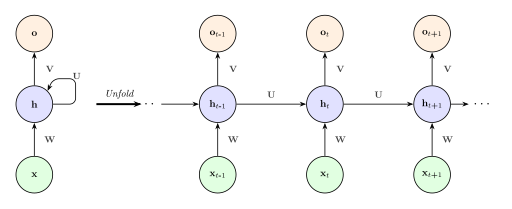

# L12a: Introduction to Recurrent Neural Networks (RNNs)
In this lecture, we will explore the fundamentals of Recurrent Neural Networks (RNNs), a class of neural networks designed to handle sequential data. RNNs are useful for tasks such as language modeling, time series prediction, and sequence classification.

> __Learning Objectives:__
> 
> By the end of this lecture, you should be able to:
>
> * __Understand RNN architecture and memory mechanisms:__ Explain how RNNs maintain hidden states to process sequential data and describe the differences between Elman and Jordan network architectures.
> * __Apply RNN equations to compute outputs:__ Use the Elman and Jordan RNN equations to compute hidden states and outputs given sequential inputs and previous states.
> * __Identify RNN training challenges:__ Describe the vanishing and exploding gradient problems in backpropagation through time (BPTT) and explain how gating mechanisms address these challenges.

Let's get started!
___

## Example
Today, we will use the following examples to illustrate key concepts:

> [▶ Tissue Factor-Initiated Coagulation Model](CHEME-5820-L12a-Advanced-Coagulation-Simulation-Spring-2026.ipynb). In this notebook, we explore the Hockin-Mann coagulation model that generates the training data for the Elman RNN. We simulate thrombin generation at different tissue factor concentrations and coagulation factor levels.

> [▶ Recurrent Neural Networks for Time Series Prediction](CHEME-5820-L12a-Example-RNN-TimeSeries-Spring-2026.ipynb). In this example, we apply Elman RNNs to forecast time series data. We observe how the hidden state captures temporal dependencies, compare predictions from different RNN architectures, and evaluate model performance on sequential data.

___

## General problem: Modeling a Sequence
Suppose we have a _sequence of data_ $(x_1, x_2, \ldots, x_T)$ where $T$ is the sequence length, and $x_i$ is the $i$-th element (token) of the sequence. What are some examples of sequences?

> __Examples__
> 
> In natural language processing, $x_{i}$ could be words or characters in a text. On the other hand, in time series analysis, $x_t$ could be a measurement, i.e., temperature, pressure, price, etc, at time $t$.

To model a sequence, i.e., predict the next token given past tokens, we can use tools such as [Hidden Markov Models (HMMs)](https://en.wikipedia.org/wiki/Hidden_Markov_model). However, HMMs cannot capture _long-range dependencies_ and relationships between elements in the sequence. 

> __Why not HMMs?__
>
> Hidden Markov Models (HMMs) use the [Markov property](https://en.wikipedia.org/wiki/Markov_property), which says that the future state of a system depends only on its current state and not on its past states. This assumption is restrictive for applications where relationships between sequence elements require different modeling approaches.

This is where RNNs come in. RNNs are designed to handle data sequences by maintaining a hidden state that captures information about previous inputs. This allows them to model long-range dependencies and contextual relationships between elements in the sequence.

    

      
    

## What are Recurrent Neural Networks (RNNs)?
Recurrent Neural Networks (RNNs) are artificial neural networks designed to process sequential data by retaining information about previous inputs through their internal memory. 

> __How are RNNs different from feedforward neural networks?__
>
> * __Do feedforward neural networks have memory?__ No, feedforward neural networks do not retain information about previous inputs. Thus, the parameters (weights and bias values) do not change once training is over. This means that the network is done learning and evolving. When we feed in values, an FNN applies the operations that make up the network using the values it has learned.
> * __How are RNNs different from feedforward neural networks?__ RNNs have connections that loop back on themselves, allowing them to maintain a _hidden state_ that captures information about previous inputs. This is essential for tasks such as language modeling, time-series prediction, and speech recognition, where context and dependencies between data points matter. 

Let's look at two types of RNNs: the Elman and Jordan networks.

### Elman Network: Mathematical Formulation
The Elman network is an RNN type consisting of an input layer, a hidden layer, and an output layer. The hidden layer has recurrent connections that allow it to maintain a hidden state over time: [Elman, J. L. (1990). Finding structure in time. Cognitive Science, 14(2), 179-211.](https://onlinelibrary.wiley.com/doi/10.1207/s15516709cog1402_1)

__At each time step__: an Elman RNN takes an _input_ and the previous hidden state (memory) and computes the output entry at time $t$.  Let the input vector at time $t$ be denoted as $\mathbf{x}_t\in\mathbb{R}^{d_{in}}$, the hidden state at time $t$ as $\mathbf{h}_t\in\mathbb{R}^{h}$, and the output at time $t$ as $\mathbf{y}_t\in\mathbb{R}^{d_{out}}$. 

> __Elman RNN Architecture__
>
> The following equations can describe the Elman RNN:
> $$
\boxed{
\begin{align*}
\mathbf{h}_t &= \sigma_{h}(\mathbf{U}_h \mathbf{h}_{t-1} + \mathbf{W}_x \mathbf{x}_t + \mathbf{b}_h) \\
\mathbf{y}_t &= \sigma_{y}(\mathbf{W}_y \mathbf{h}_t + \mathbf{b}_y)
\end{align*}}
> $$
> where the parameters are:
> * __Network weights__: the term $\mathbf{U}_h\in\mathbb{R}^{h\times{h}}$ is the weight matrix for the hidden state, $\mathbf{W}_x\in\mathbb{R}^{h\times{d_{in}}}$ is the weight matrix for the input, and $\mathbf{W}_y\in\mathbb{R}^{d_{out}\times{h}}$ is the weight matrix for the output
> * __Network bias__: the $\mathbf{b}_h\in\mathbb{R}^{h}$ terms denote the bias vector for the hidden state, and $\mathbf{b}_y\in\mathbb{R}^{d_{out}}$ is the bias vector for the output.
> * __Activation function__: the $\sigma_{h}$ function is a _hidden layer activation function_, such as the sigmoid or hyperbolic tangent (tanh) function, which introduces non-linearity into the RNN. The activation function $\sigma_{y}$ is an _output activation function_ that can be a softmax function for classification tasks or a linear function for regression tasks.

How many parameters are there in the Elman network? 

> __Parameter Count Elman RNN__
>
> The number of parameters in an Elman RNN can be calculated as follows:
> * _Hidden state_: The number of parameters for the hidden state is $N_{hidden} = h^2 + d_{in}h + h = h(h + d_{in} + 1)$
> * _Output_: The number of parameters for the output is $N_{output} = d_{out}h + d_{out} = d_{out}(h + 1)$
> 
> The total number of parameters in the Elman RNN is given by:
> $$
\begin{align*}
N_{total} &= N_{hidden} + N_{output} \\
&= h(h + d_{in} + 1) + d_{out}(h + 1)\quad\blacksquare
\end{align*}
> $$

#### Numerical Example: Parameter Count

Let's illustrate parameter counting with concrete dimensions. Suppose we have an Elman RNN for time series prediction with:
* Input dimension: $d_{in} = 5$ (e.g., 5 features)
* Hidden dimension: $h = 64$
* Output dimension: $d_{out} = 1$ (scalar prediction)

Then the parameter count is:
* Hidden parameters: $N_{hidden} = 64(64 + 5 + 1) = 64 \times 70 = 4480$
* Output parameters: $N_{output} = 1(64 + 1) = 65$
* **Total: $N_{total} = 4480 + 65 = 4545$ parameters**

Compare this to a feedforward network with one hidden layer of the same dimensions: such a network would have $5 \times 64 + 64 + 64 \times 1 + 1 = 449$ parameters.

The RNN has more parameters due to the recurrent weight matrix $\mathbf{U}_h$ (contributing $64^2 = 4096$ parameters), but crucially, these weights are **reused across all time steps** rather than expanded with sequence length. This weight sharing is what makes RNNs computationally efficient for variable-length sequences. The $h^2$ term dominates the parameter count when the hidden dimension is large, so doubling $h$ roughly quadruples the number of parameters. Doubling the input dimension $d_{in}$ only doubles the $d_{in}h$ term, a more modest increase.

___

### Jordan Network: Mathematical Formulation
The Jordan network is another RNN type related to the Elman network but with a different architecture. In a Jordan network, the output layer is connected back to the hidden layer, allowing the network to maintain a hidden state based on the output at the previous time step.
* [Jordan, Michael I. (1997-01-01). "Serial Order: A Parallel Distributed Processing Approach". Neural-Network Models of Cognition ,  Biobehavioral Foundations. Advances in Psychology. Vol. 121. pp. 471-495. doi:10.1016/s0166-4115(97)80111-2. ISBN 978-0-444-81931-4. S2CID 15375627.](https://www.sciencedirect.com/science/article/pii/S0166411597801112?via%3Dihub)

__Key architectural difference__: While Elman networks feed the previous hidden state directly into the hidden layer computation, Jordan networks maintain a separate state vector $\mathbf{s}_t$ that is updated based on the previous state and previous _output_ rather than previous hidden state. This means Jordan networks rely on output history rather than hidden state history, offering interpretability but requiring longer sequences to capture long-range dependencies.

__At each time step__: a Jordan RNN takes an _input_, the previous hidden state (memory), and the previous output and computes the output entry at time $t$. Thus, the Jordan network has the same structure as the Elman network but updates the hidden state differently (i.e., the output layer is connected back to the hidden layer).

Let the input vector at time $t$ be denoted as $\mathbf{x}_t\in\mathbb{R}^{d_{in}}$, the hidden state at time $t$ as $\mathbf{h}_t\in\mathbb{R}^{h}$, and the state vector at time $t$ as $\mathbf{s}_t\in\mathbb{R}^{s}$.

> __Jordan RNN Architecture__
> 
> The Jordan RNN can be described by the following equations:
> $$
\boxed{
\begin{align*}
\mathbf{h}_t &= \sigma_{h}(\mathbf{U}_h \mathbf{s}_{t} + \mathbf{W}_h \mathbf{x}_t + \mathbf{b}_h) \\
\mathbf{y}_t &= \sigma_{y}(\mathbf{W}_y \mathbf{h}_t + \mathbf{b}_y) \\
\mathbf{s}_t &= \sigma_{s}(\mathbf{W}_{ss} \mathbf{s}_{t-1} + \mathbf{W}_{sy} \mathbf{y}_{t-1} + \mathbf{b}_s) \\
\end{align*}}
> $$
> where the parameters are:
> * __Network weights__: the term $\mathbf{U}_h\in\mathbb{R}^{h\times{s}}$ is the weight matrix for the state with respect to the hidden state, $\mathbf{W}_h\in\mathbb{R}^{h\times{d_{in}}}$ is the weight matrix for the input, and $\mathbf{W}_y\in\mathbb{R}^{d_{out}\times{h}}$ is the weight matrix for the output. In addition, a Jordan network has parameters associated with the state $\mathbf{s}$, the $\mathbf{W}_{ss}\in\mathbb{R}^{s\times{s}}$ matrix is the weight matrix for the state with respect to the previous state, and $\mathbf{W}_{sy}\in\mathbb{R}^{s\times{d_{out}}}$ is the weight matrix for the state with respect to the previous output.
> * __Network bias__: the $\mathbf{b}_h\in\mathbb{R}^{h}$ terms denotes the bias vector for the hidden state, $\mathbf{b}_y\in\mathbb{R}^{d_{out}}$ is the bias vector for the output and $\mathbf{b}_s\in\mathbb{R}^{s}$ is the bias vector for the state.
> * __Activation function__: the $\sigma_{h}$ function is a _hidden layer activation function_, such as the sigmoid or hyperbolic tangent (tanh) function, which introduces non-linearity into the RNN. The activation function $\sigma_{y}$ is an _output activation function_ that can be a softmax function for classification tasks or a linear function for regression tasks, and $\sigma_{s}$ is a _state activation function_ that can be a sigmoid or tanh function.

How many parameters are there in the Jordan network? 

> __Parameter Count in Jordan RNN__
>
> The number of parameters in a Jordan RNN can be calculated as follows:
> * _Hidden state_: The number of parameters for the hidden state is $N_{hidden} = sh + d_{in}h + h = h(s + d_{in} + 1)$
> * _Output_: The number of parameters for the output is $N_{output} = d_{out}h + d_{out} = d_{out}(h + 1)$
> * _State_: The number of parameters for the state is $N_{state} = s^2 + sd_{out} + s = s(s + d_{out} + 1)$
>
> The total number of parameters in the Jordan RNN is given by: 
> $$
\begin{align*}
N_{total} &= N_{hidden} + N_{output} + N_{state} \\
N_{total} & = h(s + d_{in} + 1) + d_{out}(h + 1) + s(s + d_{out} + 1)\quad\blacksquare
\end{align*}
$$

When $s = h$ (equal state and hidden dimensions), the Jordan RNN requires approximately $h^2$ more parameters than the Elman RNN due to the state dynamics term $s(s + d_{out} + 1)$. Elman networks are more parameter-efficient because they avoid this additional quadratic term.

___

## Training challenges with RNNs
The training process for RNNs is similar to that of feedforward neural networks but with a few key differences. The main difference is that RNNs are trained using _backpropagation through time_ (BPTT), which _unrolls the network_ across sequential steps to compute gradients and update shared weights. 

> __Backpropagation through time (BPTT)__
>
> * __What is BPTT?__ Backpropagation through time (BPTT) is a variant of the backpropagation algorithm that trains recurrent neural networks (RNNs). It involves _unrolling_ the RNN across time steps, treating it as a feedforward network, and then applying the standard backpropagation algorithm to compute gradients and update weights. BPTT allows RNNs to learn from data sequences by capturing temporal dependencies and adjusting weights based on the entire sequence.
>
> * __The chain rule and gradient flow__: The key challenge in BPTT is that the recurrent weight matrix $\mathbf{U}_h$ appears in the computation of all hidden states. To compute gradients with respect to $\mathbf{U}_h$, we must backpropagate through products of Jacobians across time steps. When the eigenvalues satisfy $|\lambda| < 1$ (absolute value less than 1), these products decay exponentially with time depth, causing gradients to shrink. Specifically, gradients from distant time steps get multiplied by factors like $\lambda^t$, which approach zero exponentially as $t$ increases. Conversely, when $|\lambda| > 1$, these factors grow exponentially, destabilizing training.
> * __Issues__: However, BPTT is prone to the __vanishing gradients problem__, where gradients shrink exponentially during backpropagation (when eigenvalues $|\lambda| < 1$), hindering the learning of long-term dependencies, and the __exploding gradients problem__, where unchecked gradient growth destabilizes training (when $|\lambda| > 1$). 
>
> For a step-by-step derivation of the BPTT gradient and the vanishing gradient conditions, see the [Advanced BPTT Derivation notebook](CHEME-5820-L12a-Advanced-Derivation-BPTT-Spring-2026.ipynb). In addition, see [Chapter 10 of Goodfellow et al.](http://www.deeplearningbook.org/). 

Let's look at an example of a RNN in action on a time series prediction task, namely, the predictiomn of Thormbin activation. 

> __Example: RNNs for Time Series Prediction__
>
> * [▶ Tissue Factor-Initiated Coagulation Model](CHEME-5820-L12a-Advanced-Coagulation-Simulation-Spring-2026.ipynb). In this notebook, we explore the Hockin-Mann coagulation model that generates the training data for the Elman RNN. We simulate thrombin gene`ration at different tissue factor concentrations and coagulation factor levels.
>
> * [▶ Recurrent Neural Networks for Time Series Prediction](CHEME-5820-L12a-Example-RNN-TimeSeries-Spring-2026.ipynb). In this example, we apply Elman RNNs to forecast time series data. We observe how the hidden state captures temporal dependencies, compare predictions from different RNN architectures, and evaluate model performance on sequential data.

___

## Where do we go from here? 
These training challenges (and other factors) led to advanced architectures like [Long short-term memory (LSTMs) and Gated Recurrent Units (GRUs)](https://arxiv.org/pdf/1412.3555), which use gating mechanisms to better regulate information flow and mitigate gradient issues.

> __What is gating?__ Gating mechanisms are components in neural networks, particularly in recurrent neural networks (RNNs), that control the flow of information by selectively allowing or blocking specific inputs or activations. They help manage the network's memory and learning process, enabling it to retain relevant information over time and discard irrelevant data. 

Let's watch [a Video from the IBM technology channel about LSTMs](https://www.youtube.com/watch?v=b61DPVFX03I)

___

## Summary
Recurrent Neural Networks process sequential data by maintaining hidden states that capture information about previous inputs, with Elman and Jordan networks representing two foundational architectures that differ in how they update their hidden states.

> __Key Takeaways:__
>
> * **Elman and Jordan RNNs maintain memory through hidden states**: Elman networks update hidden states based on previous hidden states and current inputs, while Jordan networks use previous outputs to update their state vectors. Both architectures process sequences by applying the same weight matrices across time steps.
> * **RNNs require backpropagation through time for training**: BPTT unrolls the RNN across time steps to compute gradients and update shared weights. However, this approach is prone to vanishing and exploding gradient problems that hinder learning of long-term dependencies.
> * **Gating mechanisms address gradient challenges**: LSTMs and GRUs use gates to control information flow through the network, mitigating gradient problems and enabling better learning of long-range dependencies in sequential data.

The vanishing gradient problem is a fundamental limitation of the Elman architecture, and motivates the gated architectures (LSTMs and GRUs) that we develop in the [L12c lecture](../L12c/CHEME-5820-L12c-Lecture-LSTM-Spring-2026.ipynb).
___
