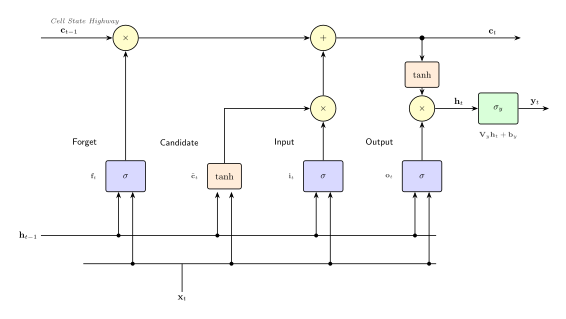

# L12c: Long Short-Term Memory (LSTM) Networks
In this lecture, we will explore Long Short-Term Memory (LSTM) networks and Gated Recurrent Units (GRUs), two gated recurrent architectures that address the vanishing gradient problem in standard RNNs. LSTMs and GRUs use gates to control information flow through the network, enabling them to capture long-range temporal dependencies in sequential data.

> __Learning Objectives:__
>
> By the end of this lecture, you should be able to:
>
> * __Understand LSTM gating architecture and cell state:__ Explain how the forget, input, and output gates control information flow through the cell state, and why this addresses the vanishing gradient problem.
> * __Apply LSTM and GRU equations to compute outputs:__ Use the LSTM and GRU gate equations to compute hidden states and outputs given sequential inputs, and compute the total parameter count for each architecture.
> * __Compare LSTM, GRU, and Elman RNN capabilities:__ Identify when a gated architecture is preferred over an Elman RNN based on sequence length, temporal dependency range, and parameter budget.

Let's get started!
___

## Example
Today, we will use the following examples to illustrate key concepts:

> [▶ LSTM Networks for Fed-Batch CHO Bioreactor Prediction](CHEME-5820-L12c-Example-LSTM-CHO-Spring-2026.ipynb). In this example, we apply an LSTM to predict multi-state bioreactor trajectories in a fed-batch CHO cell culture. We train the LSTM to predict all seven bioreactor states (volume, biomass, glucose, glutamine, antibody, lactate, ammonia) conditioned on a glucose-triggered feed policy.

___

## Recap: Training Challenges with RNNs
In the [L12a lecture on Recurrent Neural Networks](CHEME-5820-L12a-Lecture-RecurrentNetworks-Spring-2026.ipynb), we saw that Elman RNNs are trained using _backpropagation through time_ (BPTT), which unrolls the network across time steps to compute gradients. The recurrent weight matrix $\mathbf{U}_h$ appears in the computation of all hidden states, so computing gradients requires backpropagating through products of Jacobian matrices across time steps.

> __Vanishing and exploding gradients__
>
> When the eigenvalues of the recurrent weight matrix satisfy $|\lambda| < 1$, the gradient products decay exponentially with time depth, causing gradients from distant time steps to vanish. When $|\lambda| > 1$, these products grow exponentially, causing gradients to explode. Both scenarios prevent the network from learning long-range temporal dependencies.

Can we design an architecture that avoids this problem? The key insight is to introduce a _cell state_ that flows through the network with minimal transformation, providing a direct path for gradients to flow backward through many time steps. This is the idea behind LSTM networks.

    

      
    

## What are Long Short-Term Memory (LSTM) Networks?
Long Short-Term Memory (LSTM) networks are a class of gated recurrent neural networks designed to capture long-range temporal dependencies by maintaining a _cell state_ that acts as a gradient highway. LSTMs were introduced by [Hochreiter and Schmidhuber (1997)](https://doi.org/10.1162/neco.1997.9.8.1735).

> __How are LSTMs different from Elman RNNs?__
>
> * __Do Elman RNNs have a cell state?__ No. Elman RNNs have a single hidden state $\mathbf{h}_t$ that is overwritten at each time step via a nonlinear transformation. This creates the long chain of Jacobian products that causes vanishing or exploding gradients.
> * __How are LSTMs different?__ LSTMs maintain a separate _cell state_ $\mathbf{c}_t$ alongside the hidden state $\mathbf{h}_t$. The cell state is updated through element-wise gating operations rather than matrix multiplications, which allows gradients to flow backward with minimal decay. Three gates (forget, input, output) control what information enters, persists in, and exits the cell state.

Let's look at two gated architectures: the LSTM and the GRU.

### LSTM Network: Mathematical Formulation
The LSTM cell uses three gates to control information flow through the cell state. At each time step, the LSTM takes an input, the previous hidden state, and the previous cell state, and computes the output at time $t$. Let the input vector at time $t$ be denoted as $\mathbf{x}_t\in\mathbb{R}^{d_{in}}$, the hidden state at time $t$ as $\mathbf{h}_t\in\mathbb{R}^{h}$, and the cell state at time $t$ as $\mathbf{c}_t\in\mathbb{R}^{h}$.

> __LSTM Architecture__
>
> The following equations describe the LSTM cell:
> $$
\boxed{
\begin{align*}
\mathbf{f}_t &= \sigma(\mathbf{W}_f \mathbf{x}_t + \mathbf{U}_f \mathbf{h}_{t-1} + \mathbf{b}_f) & \text{(forget gate)} \\
\mathbf{i}_t &= \sigma(\mathbf{W}_i \mathbf{x}_t + \mathbf{U}_i \mathbf{h}_{t-1} + \mathbf{b}_i) & \text{(input gate)} \\
\tilde{\mathbf{c}}_t &= \tanh(\mathbf{W}_c \mathbf{x}_t + \mathbf{U}_c \mathbf{h}_{t-1} + \mathbf{b}_c) & \text{(candidate cell state)} \\
\mathbf{c}_t &= \mathbf{f}_t \odot \mathbf{c}_{t-1} + \mathbf{i}_t \odot \tilde{\mathbf{c}}_t & \text{(cell state update)} \\
\mathbf{o}_t &= \sigma(\mathbf{W}_o \mathbf{x}_t + \mathbf{U}_o \mathbf{h}_{t-1} + \mathbf{b}_o) & \text{(output gate)} \\
\mathbf{h}_t &= \mathbf{o}_t \odot \tanh(\mathbf{c}_t) & \text{(hidden state)} \\
\mathbf{y}_t &= \sigma_y(\mathbf{V}_y \mathbf{h}_t + \mathbf{b}_y) & \text{(output)}
\end{align*}}
> $$
> where the parameters are:
> * __Gate weights__: the terms $\mathbf{W}_f, \mathbf{W}_i, \mathbf{W}_c, \mathbf{W}_o\in\mathbb{R}^{h\times{d_{in}}}$ are the input weight matrices for each gate, $\mathbf{U}_f, \mathbf{U}_i, \mathbf{U}_c, \mathbf{U}_o\in\mathbb{R}^{h\times{h}}$ are the recurrent weight matrices for each gate
> * __Gate biases__: the terms $\mathbf{b}_f, \mathbf{b}_i, \mathbf{b}_c, \mathbf{b}_o\in\mathbb{R}^{h}$ are the bias vectors for each gate
> * __Output weights__: the term $\mathbf{V}_y\in\mathbb{R}^{d_{out}\times{h}}$ is the output projection matrix and $\mathbf{b}_y\in\mathbb{R}^{d_{out}}$ is the output bias vector
> * __Activation functions__: the $\sigma$ function is the sigmoid function for gates (outputs in $(0,1)$), $\tanh$ is used for candidate cell state and hidden state, and $\sigma_y$ is the output activation function (sigmoid for normalized targets, linear for regression)

Each gate serves a specific role. The __forget gate__ $\mathbf{f}_t$ controls what information to discard from the previous cell state. The __input gate__ $\mathbf{i}_t$ controls what new information to write to the cell state. The __output gate__ $\mathbf{o}_t$ controls what information from the cell state to expose as the hidden state.

How many parameters are there in the LSTM?

> __Parameter Count LSTM__
>
> The number of parameters in an LSTM can be calculated as follows:
> * _Gates_: Each of the 4 gates (forget, input, candidate, output) has $h \cdot d_{in} + h \cdot h + h = h(d_{in} + h + 1)$ parameters, giving $N_{gates} = 4h(h + d_{in} + 1)$
> * _Output_: The output projection has $N_{output} = d_{out}h + d_{out} = d_{out}(h + 1)$
>
> The total number of parameters in the LSTM is given by:
> $$
\begin{align*}
N_{total} &= N_{gates} + N_{output} \\
&= 4h(h + d_{in} + 1) + d_{out}(h + 1)\quad\blacksquare
\end{align*}
> $$

#### Numerical Example: Parameter Count

Let's illustrate parameter counting with concrete dimensions. Suppose we have an LSTM for a multi-state bioreactor prediction task with:
* Input dimension: $d_{in} = 10$ (7 states + 3 conditioning parameters)
* Hidden dimension: $h = 128$
* Output dimension: $d_{out} = 7$ (predict all 7 bioreactor states)

Then the parameter count is:
* Gate parameters: $N_{gates} = 4 \times 128 \times (128 + 10 + 1) = 4 \times 128 \times 139 = 71{,}168$
* Output parameters: $N_{output} = 7 \times (128 + 1) = 903$
* **Total: $N_{total} = 71{,}168 + 903 = 72{,}071$ parameters**

Compare this to an Elman RNN with the same dimensions: $N_{total}^{\text{Elman}} = 128 \times 139 + 903 = 17{,}792 + 903 = 18{,}695$ parameters. The LSTM has approximately $4\times$ more parameters because it has four gate computations instead of one hidden state computation. These additional parameters enable the LSTM to learn what to remember and what to forget, but the weights are still **reused across all time steps**.

___

### GRU Network: Mathematical Formulation
The Gated Recurrent Unit (GRU) is a related gated architecture introduced by [Cho et al. (2014)](https://arxiv.org/abs/1406.1078) that simplifies the LSTM by combining the forget and input gates into a single _update gate_ and merging the cell state and hidden state into a single state vector.

__Key architectural difference__: While LSTMs maintain a separate cell state $\mathbf{c}_t$ and hidden state $\mathbf{h}_t$, GRUs use only a hidden state $\mathbf{h}_t$. The update gate controls how much of the previous hidden state to retain, and the reset gate controls how much of the previous hidden state to use when computing the candidate. This makes GRUs more parameter-efficient but with less flexibility than LSTMs.

__At each time step__: a GRU takes an input and the previous hidden state and computes the output at time $t$. Let the input vector at time $t$ be denoted as $\mathbf{x}_t\in\mathbb{R}^{d_{in}}$ and the hidden state at time $t$ as $\mathbf{h}_t\in\mathbb{R}^{h}$.

> __GRU Architecture__
>
> The following equations describe the GRU:
> $$
\boxed{
\begin{align*}
\mathbf{z}_t &= \sigma(\mathbf{W}_z \mathbf{x}_t + \mathbf{U}_z \mathbf{h}_{t-1} + \mathbf{b}_z) & \text{(update gate)} \\
\mathbf{r}_t &= \sigma(\mathbf{W}_r \mathbf{x}_t + \mathbf{U}_r \mathbf{h}_{t-1} + \mathbf{b}_r) & \text{(reset gate)} \\
\tilde{\mathbf{h}}_t &= \tanh(\mathbf{W}_h \mathbf{x}_t + \mathbf{U}_h (\mathbf{r}_t \odot \mathbf{h}_{t-1}) + \mathbf{b}_h) & \text{(candidate hidden state)} \\
\mathbf{h}_t &= (1 - \mathbf{z}_t) \odot \mathbf{h}_{t-1} + \mathbf{z}_t \odot \tilde{\mathbf{h}}_t & \text{(hidden state update)}
\end{align*}}
> $$
> where the parameters are:
> * __Gate weights__: the terms $\mathbf{W}_z, \mathbf{W}_r, \mathbf{W}_h\in\mathbb{R}^{h\times{d_{in}}}$ are the input weight matrices, $\mathbf{U}_z, \mathbf{U}_r, \mathbf{U}_h\in\mathbb{R}^{h\times{h}}$ are the recurrent weight matrices
> * __Gate biases__: the terms $\mathbf{b}_z, \mathbf{b}_r, \mathbf{b}_h\in\mathbb{R}^{h}$ are the bias vectors for each gate
> * __Activation functions__: the $\sigma$ function is the sigmoid function for gates, and $\tanh$ is used for the candidate hidden state

How many parameters are there in the GRU?

> __Parameter Count GRU__
>
> The number of parameters in a GRU can be calculated as follows:
> * _Gates_: Each of the 3 gates (update, reset, candidate) has $h(d_{in} + h + 1)$ parameters, giving $N_{gates} = 3h(h + d_{in} + 1)$
> * _Output_: The output projection has $N_{output} = d_{out}(h + 1)$
>
> The total number of parameters in the GRU is given by:
> $$
\begin{align*}
N_{total} &= N_{gates} + N_{output} \\
&= 3h(h + d_{in} + 1) + d_{out}(h + 1)\quad\blacksquare
\end{align*}
> $$

___

## Computational Complexity and Parameter Scaling
Understanding how parameter count scales across architectures is important for practical applications.

> __Parameter count comparison: LSTM vs. GRU vs. Elman__
>
> **LSTM** with $d_{in}$ inputs, hidden dimension $h$, and $d_{out}$ outputs:
> $$N_{total}^{\text{LSTM}} = 4h(h + d_{in} + 1) + d_{out}(h + 1)$$
>
> **GRU** with $d_{in}$ inputs, hidden dimension $h$, and $d_{out}$ outputs:
> $$N_{total}^{\text{GRU}} = 3h(h + d_{in} + 1) + d_{out}(h + 1)$$
>
> **Elman RNN** with $d_{in}$ inputs, hidden dimension $h$, and $d_{out}$ outputs:
> $$N_{total}^{\text{Elman}} = h(h + d_{in} + 1) + d_{out}(h + 1)$$

> __Scaling behavior analysis__
>
> * __Gate multiplier dominates:__ The LSTM uses $4\times$, GRU uses $3\times$, and Elman uses $1\times$ the gate computation, so the LSTM has roughly $4\times$ the parameters of an Elman RNN with the same hidden dimension.
> * __Dominant term is quadratic:__ The $h^2$ term dominates when the hidden dimension is large, so doubling the hidden dimension roughly quadruples the gate parameters.
> * __Sequence length doesn't matter:__ Parameter count is independent of sequence length because weights are reused across all time steps.
> * __Comparable performance, different tradeoffs:__ In practice, LSTMs and GRUs achieve similar performance on most tasks. GRUs are more parameter-efficient ($3/4$ the gate parameters of an LSTM), while LSTMs provide more flexibility through the separate cell state.

For the numerical example above ($d_{in} = 10$, $h = 128$, $d_{out} = 7$):
* LSTM: $72{,}071$ parameters
* GRU: $3 \times 128 \times 139 + 903 = 54{,}279$ parameters
* Elman: $128 \times 139 + 903 = 18{,}695$ parameters

___

## Summary
LSTM and GRU networks address the vanishing gradient problem in standard RNNs by introducing gating mechanisms that control information flow through the network. LSTMs use a separate cell state as a gradient highway, while GRUs achieve a similar effect with fewer parameters by merging the cell state and hidden state.

> __Key Takeaways:__
>
> * **LSTMs maintain memory through a gated cell state**: The cell state provides an unimpeded path for gradients to flow backward through many time steps, while the forget, input, and output gates learn what to remember and what to discard. This directly addresses the vanishing gradient problem that limits Elman RNNs.
> * **GRUs simplify the gating architecture**: GRUs combine the forget and input gates into a single update gate and merge the cell state with the hidden state, achieving comparable performance with approximately $3/4$ the gate parameters of an LSTM.
> * **Gated architectures trade parameters for long-range capability**: LSTMs use approximately $4\times$ and GRUs approximately $3\times$ more parameters than Elman RNNs, but these additional parameters enable learning long-range temporal dependencies that standard RNNs cannot capture.

For a numerical example applying LSTM networks to a fed-batch bioreactor prediction task, see the [L12c example notebook](CHEME-5820-L12c-Example-LSTM-CHO-Spring-2026.ipynb).
___
