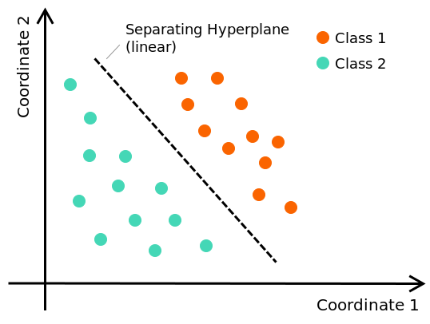

# L4a: Logistic Regression
In this lecture, we'll explore logistic regression, a fundamental technique for binary classification. Unlike the Perceptron's deterministic approach, we now adopt a probabilistic framework for binary classification. This allows us to not only predict class labels but also quantify confidence in our predictions.

> __Learning Objectives__
> 
> By the end of this lecture, you will be able to:
> * __Understand the probabilistic framework for binary classification:__ Develop logistic regression from the Boltzmann distribution to model conditional class probabilities as a function of input features and derive the logistic function from first principles.
> * __Learn parameter estimation using maximum likelihood:__ Apply gradient descent to minimize the negative log-likelihood (cross-entropy loss) and understand convergence properties for convex optimization problems.
> * __Apply regularization to prevent overfitting:__ Use L1 and L2 regularization techniques to control model complexity and improve generalization to unseen data.

Let's get started!

___

## Examples
Today, we will use the following examples to illustrate key concepts:
 
> [▶ Logistic classification of a banknote dataset](CHEME-5820-L3c-Example-LogisticRegression-GD-Spring-2026.ipynb). In this example, we'll use logistic regression to classify authentic and inauthentic banknotes based on features extracted from images of the banknotes. We'll train a logistic regression model using gradient descent and evaluate its performance using the confusion matrix.

___

    

        
    

## Binary Classification Problem
Linear regression can be adapted for classification by transforming the continuous output into a class designation. We can do this in two ways: directly to a class designation or to a probability using an __activation function__ $\sigma:\mathbb{R}\rightarrow{\mathbb{R}}$.

Let's examine two binary classification strategies:

* [The Perceptron (Rosenblatt, 1957)](https://en.wikipedia.org/wiki/Perceptron) is an algorithm for binary classification that learns a linear decision boundary separating two classes. The Perceptron maps continuous output to a class such as $\sigma:\mathbb{R}\rightarrow\{-1,+1\}$ using $\sigma(\star) = \text{sign}(\star)$.
* [Logistic regression](https://en.wikipedia.org/wiki/Logistic_regression#) uses the [logistic function](https://en.wikipedia.org/wiki/Logistic_function) to transform linear regression output into a probability. This approach is effective for various applications. We'll explore logistic regression in the next module.

Today, we focus on __the Perceptron__ and __logistic regression__ as foundational methods for binary classification. The Perceptron provides a hard decision rule (class or no class), while logistic regression offers a probabilistic framework that quantifies confidence in predictions.
___

## Derivation
Suppose we view our two–class labels $y\in\{-1,1\}$ as _states_ in a Boltzmann distribution conditioned on the input $\hat{\mathbf{x}}\in\mathbb{R}^{m+1}$ (the original feature vector with a `1` as the last element to account for a bias). Then for any state $y$ with energy $E(y,\hat{\mathbf{x}})$ at inverse temperature $\beta$, the conditional probability of observing the label $y\in\left\{-1,+1\right\}$ given the feature vector $\hat{\mathbf{x}}$ can be represented as
$$
\begin{align*}
P(y\mid \hat{\mathbf{x}})
=\frac{\exp\bigl(-\beta E(y,\hat{\mathbf{x}})\bigr)}
      {\underbrace{\sum_{y' \in\{-1,1\}} \exp\bigl(-\beta E(y',\hat{\mathbf{x}})\bigr)}_{Z(\hat{\mathbf{x}})}}.
\end{align*}
$$

The partition function $Z(\hat{\mathbf{x}}) = \sum_{y' \in\{-1,1\}} \exp(-\beta E(y',\hat{\mathbf{x}}))$ normalizes the probabilities so they sum to one across all possible labels.

### Understanding Inverse Temperature $\beta$

The inverse temperature $\beta > 0$ is a fundamental parameter that controls how the energy function translates into probabilities. Think of $\beta$ as controlling the "confidence" or "commitment" of the model to its decisions:

> __Physical Intuition for $\beta$:__
> 
> * **Large $\beta$ (cold system, low temperature):** The exponential function becomes increasingly selective, small energy differences translate into large probability differences. The model becomes highly confident, approaching a hard decision boundary. As $\beta \to \infty$, the logistic function becomes arbitrarily sharp, and for any input where $2y(\hat{\mathbf{x}}^{\top}\theta) > 0$, the probability approaches 1; where $2y(\hat{\mathbf{x}}^{\top}\theta) < 0$, it approaches 0. The smooth sigmoid becomes a hard threshold, resembling the Perceptron's sign function.
> 
> * **Small $\beta$ (hot system, high temperature):** The exponential function flattens, and all states become roughly equally probable regardless of energy differences. The model becomes uncertain, assigning probability near 0.5 to both classes. As $\beta \to 0$, the logistic function approaches the constant 0.5 for all inputs, treating all predictions as equally uncertain regardless of $\hat{\mathbf{x}}^{\top}\theta$.
> 
> * **$\beta = 1$ (default):** Provides a balance between confidence and uncertainty, often used as the baseline.
> 
> __Practical Implications:__ In practice, $\beta$ is often absorbed into the weight vector $\theta$ (by rescaling), but keeping it explicit allows independent control of prediction confidence. Well-calibrated probabilistic models often use $\beta$ values closer to 1, while risk-averse applications (e.g., disease screening) might use smaller $\beta$ to avoid overconfident predictions, and high-stakes applications (e.g., fraud detection) might use larger $\beta$ for decisive action.

For the energy function, we use a linear model of the form:
$$
\begin{align*}
E(y,\hat{\mathbf{x}})\;=\;-\,y\;\bigl(\hat{\mathbf{x}}^{\top}\theta \bigr).
\end{align*}
$$
where $\theta\in\mathbb{R}^{p}$ is a vector of __unknown__ parameters (weights plus bias) that we want to learn. This energy definition creates a natural alignment: when $\hat{\mathbf{x}}^{\top}\theta$ is large and positive, the energy for $y=+1$ is low (favoring that label), while the energy for $y=-1$ is high (disfavoring it).

When $y=+1$, the energy $E(1,\hat{\mathbf{x}})=-\hat{\mathbf{x}}^{\top}\theta$ is *lower* (more probable) if $\hat{\mathbf{x}}^{\top}\theta$ is large. On the other hand, when $y=-1$, the energy $E(-1,\hat{\mathbf{x}})=+\hat{\mathbf{x}}^{\top}\theta$, so $y=-1$ is favored when $\hat{\mathbf{x}}^{\top}\theta$ is very negative.

Let's substitute the energy function into the conditional probability expression and do some algebra:
$$
\begin{align*}
P_{\theta}(y\mid \hat{\mathbf{x}})
& =\frac{\exp\bigl(-\beta E(y,\hat{\mathbf{x}})\bigr)}
      {\underbrace{\sum_{y' \in\{-1,1\}} \exp\bigl(-\beta E(y',\hat{\mathbf{x}})\bigr)}_{Z(\hat{\mathbf{x}})}}\\
&=\frac{\exp\bigl(\beta y\left(\hat{\mathbf{x}}^{\top}\theta\right)\bigr)}
      {\exp\bigl(\beta\hat{\mathbf{x}}^{\top}\theta\bigr) + \exp\bigl(-\beta\hat{\mathbf{x}}^{\top}\theta\bigr)}\quad\Longrightarrow\;{\text{substituting } z = \beta\hat{\mathbf{x}}^{\top}\theta}\\
& = \frac{\exp\bigl(yz\bigr)}
      {\exp\bigl(z\bigr) + \exp\bigl(-z\bigr)}\quad\Longrightarrow\;{\text{factor out}\; \exp(yz)\;\text{from denominator}}\\
& = \frac{\exp\bigl(yz\bigr)}
      {\exp\bigl(yz\bigr)\left(\exp\bigl((1-y)z\bigr) + \exp\bigl(-(1+y)z\bigr)\right)}\quad\Longrightarrow\;\text{cancel}\;\exp(yz)\\
& = \frac{1}
      {\exp\bigl((1-y)z\bigr) + \exp\bigl(-(1+y)z\bigr)}\quad\blacksquare\\
\end{align*}
$$

This expression is the probability of observing the label $y$ given the feature vector $\hat{\mathbf{x}}$ and the parameters $\theta$. Let's look at the case when $y=+1$ and $y=-1$:

> __Cases:__
>
> When $y=+1$, we have:
> $$
\begin{align*}
P_{\theta}(y = +1\mid \hat{\mathbf{x}})
& = \frac{1}
      {\exp\bigl(0\bigr) + \exp\bigl(-2\beta\left(\hat{\mathbf{x}}^{\top}\theta\right)\bigr)}\\
& = \frac{1}
      {1 + \exp\bigl(-2\beta\left(\hat{\mathbf{x}}^{\top}\theta\right)\bigr)}\quad\blacksquare\\
\end{align*}
$$
> 
> When $y=-1$, we have:
> $$\begin{align*}
P_{\theta}(y = -1\mid \hat{\mathbf{x}})
& = \frac{1}
      {\exp\bigl(2\beta\left(\hat{\mathbf{x}}^{\top}\theta\right)\bigr) + \exp\bigl(0\bigr)}\\
& = \frac{1}
      {1+\exp\bigl(2\beta\left(\hat{\mathbf{x}}^{\top}\theta\right)\bigr)}\quad\blacksquare\\
\end{align*}
$$
> Putting this all together, we can write the conditional probability of observing the label $y$ given the feature vector $\hat{\mathbf{x}}$ and the parameters $\theta$ as:
> $$\begin{align*}
P_{\theta}(y\mid \hat{\mathbf{x}}) & = \frac{1}{1+\exp\bigl(-2\beta y\left(\hat{\mathbf{x}}^{\top}\theta\right)\bigr)}\quad\Longrightarrow\;\text{Logistic function!}\\
& = \sigma\bigl(2\beta y\left(\hat{\mathbf{x}}^{\top}\theta\right)\bigr)\\
\end{align*}$$

The logistic function $\sigma(\cdot)$ is a sigmoid activation function that maps any real-valued input to the interval $(0, 1)$, making it ideal for modeling probabilities. In logistic regression, the function compresses the linear predictor $2\beta y(\hat{\mathbf{x}}^{\top}\theta)$ into a probability space, providing a smooth, differentiable decision boundary between classes.

___

## Parameter Estimation: Learning from Data
Now that we have a probabilistic model, the logistic function $\sigma(2\beta y(\hat{\mathbf{x}}^{\top}\theta))$, we need to learn the parameters $\theta$ that make our model fit the observed data well. We do this by finding parameters that maximize the likelihood of observing the training labels given the features.

Of course, we want to learn the parameters $\theta$ so that we maximize the log likelihood (or minimize the negative log-likelihood) of the observed labels given the feature vectors. The likelihood function is given by:
$$
\begin{align*}
\mathcal{L}(\theta) & = \prod_{i=1}^{n} P_{\theta}(y_{i}\mid \hat{\mathbf{x}}_{i})\\
& = \prod_{i=1}^{n} \frac{1}{1+\exp\bigl(-2\beta y_{i}\,\left(\hat{\mathbf{x}}^{\top}_{i}\theta\right)\bigr)}\quad\Longrightarrow\;\text{Product is $\textbf{hard}$ to optimize! Take the $\log$}\\
\log\mathcal{L}(\theta) & = -\sum_{i=1}^n \log\!\bigl(1+\exp\bigl(-2\beta y_i\,\left(\hat{\mathbf{x}}^{\top}_{i}\theta\right)\bigr)\bigr)\\
\end{align*}
$$  

We can use gradient descent to minimize the negative log-likelihood (also known as the cross-entropy loss function):
$$
\boxed{
\begin{align*}
J(\theta) & = -\log\mathcal{L}(\theta)\\
& = \sum_{i=1}^n \log\!\bigl(1+\exp\bigl(-2\beta y_i\,\left(\hat{\mathbf{x}}^{\top}_{i}\theta\right)\bigr)\bigr)\quad\blacksquare\\
\end{align*}}
$$      
This will give us the optimal parameters $\theta$ for our logistic regression model:
$$
\hat{\theta} = \arg\min_{\theta} J(\theta)
$$

Gradient descent can minimize this loss function to learn the optimal parameters for binary classification. The example notebook demonstrates this approach on a real dataset.

### Advanced Review Topics: Optimization Methods
For a deeper understanding of gradient descent and constrained optimization, see the advanced notebooks:

> [▶ Gradient Descent](docs/CHEME-5820-L3c-Advanced-GradientDescent-Spring-2026.ipynb). This notebook develops gradient descent algorithms for both unconstrained and constrained optimization problems, including barrier and penalty methods for handling constraints.
> 
> [▶ General Nonlinear Optimization Problem](docs/CHEME-5820-L3c-Advanced-GeneralProblem-Spring-2026.ipynb). This notebook presents the general constrained nonlinear optimization framework, Lagrangian formulation, and Karush-Kuhn-Tucker (KKT) optimality conditions.

#### Simplified Gradient Descent
Gradient descent minimizes a function by iteratively adjusting the parameters in the _opposite direction_ of the gradient. 
> __Gradient?__ The gradient is a vector that points in the direction of the steepest increase of the function, and its magnitude indicates how steep the slope is in that direction. Thus, the negative gradient points in the direction of the steepest decrease of the function.

Let's examine a simple algorithm for estimating the parameters $\theta$ using gradient descent.

__Initialization:__ We start with an initial guess for the parameters $\theta^{(0)}\in\mathbb{R}^{p}$, which can be a random vector or a vector of zeros. Specify a learning rate $\alpha(k)>0$ (which can be constant or a function of the iteration count $k$) and a stopping criterion, e.g., a small threshold $\epsilon>0$ and a maximum number of iterations `maxiter`. Set $\texttt{converged}\gets\texttt{false}$ and the iteration count $k\gets0$.

While not $\texttt{converged}$ __do__:
1. Compute the update direction $\mathbf{d} = -\nabla_{\theta}L(\theta^{(k)})$, where $\nabla_{\theta}L(\theta^{(k)})$ is the gradient of the loss function with respect to the parameters at iteration $k$.
2. Update the parameters $\theta^{(k+1)} = \theta^{(k)} + \alpha(k)\cdot\mathbf{d}$.
3. Check the stopping criterion:
   - If $\lVert\theta^{(k+1)} - \theta^{(k)}\rVert\leq\epsilon$, set $\texttt{converged} = \texttt{true}$. Alternatively, if the gradient is small at the current iteration, i.e., $\lVert\nabla_{\theta}L(\theta^{(k)})\rVert\leq\epsilon$, set $\texttt{converged} = \texttt{true}$.
   - If $k\geq\texttt{maxiter}$, set $\texttt{converged} = \texttt{true}$.
     > __Optional__:
     >  Warn the user that the maximum number of iterations has been reached _without convergence_.
   - If neither of the above conditions is met, continue iterating.
4. Increment the iteration count $k\gets k+1$, and update the learning rate $\alpha(k)$, if applicable.

Let's take a closer look at some of the key components of this algorithm:
* __What is $\alpha(k)$?__ The (hyper) parameter $\alpha(k)>0$ is the _learning rate_ which can be a function of the iteration count $k$. This is a user-adjustable parameter, and we'll assume it's constant for today. Alternatively, we can have a mechanism to adjust the learning rate. The learning rate controls how much we adjust the parameters at each iteration. If it's too large, we may overshoot the minimum; if it's too small, convergence may be slow.
* __Stopping?__ Gradient descent will continue to iterate until a stopping criterion is met, i.e., $\lVert\theta^{(k+1)} - \theta^{(k)}\rVert\leq\epsilon$ or the maximum number of iterations is reached, or some other stopping criterion is met, i.e., the gradient is small at the current iteration $\lVert\nabla_{\theta}L(\theta^{(k)})\rVert\leq\epsilon$. Here, we have a choice in defining the stopping criterion, such as which component to monitor or which norm to use. The choice of stopping criterion can affect the algorithm's convergence.

**How good is gradient descent?**

Like most things in life, it depends. It depends on the problem, the learning rate you choose, and your stopping rule. In practice, gradient descent works very well for logistic regression, thanks to the convex, single-minimum shape of the loss, but can struggle on non-convex losses or if you pick a rate that’s too large or too small.

* **A smooth, bowl-shaped loss:** The logistic loss is like a gently sloping bowl with exactly one minimum. Its gradient can’t change too abruptly, so if you pick a step size up to about $1/L$, where $L$ is the Lipschitz constant of the gradient, you’re guaranteed to keep rolling down toward that unique bottom.
* **Slowing down over time:** Initially, you make large improvements in the loss, but each subsequent step helps a bit less than the last. After $k$ steps, your gap to the optimal loss shrinks on the order of $1/k$. In other words, you sprint at first, then settle into a steady jog.
* **Adding regularization speeds things up:** If you add $l_{2}$ (ridge) regularization, the loss becomes strongly convex. The bowl gets uniformly steeper, and each gradient descent step reduces the remaining error by a constant fraction, leading to exponentially fast convergence.
* **Picking the proper rate:** The _sweet spot_ for the learning rate is roughly $\alpha\approx 2/(L+\mu)$, where $\mu$ is the strong-convexity constant (the minimum curvature at the bottom). But even the simpler choice $\alpha=1/L$ still guarantees a steady, reliable decrease each iteration.

Several techniques can accelerate convergence beyond basic gradient descent:

> __Advanced Optimization Techniques:__
> 
> * **Diminishing learning rates:** Decrease the learning rate over time (e.g., $\alpha_k = \alpha_0/k$) to ensure convergence when the optimal step size is unknown. Early iterations take larger steps, while later iterations make finer adjustments.
> * **Momentum methods:** Build velocity by accumulating gradients from previous iterations, helping to smooth oscillations and accelerate convergence, especially when the loss surface is poorly conditioned or has flat regions.
> * **Second-order methods:** Newton's method uses curvature information (the Hessian matrix) to take more informed steps, achieving faster convergence near the minimum but requiring additional computation for second derivatives.

__Alternatives to gradient descent?__ Yes, computing the gradient is a _hassle_. There are alternatives to gradient descent that evaluate the objective function directly, such as the [Nelder-Mead Simplex Algorithm](https://en.wikipedia.org/wiki/Nelder%E2%80%93Mead_method), [Simulated Annealing](https://en.wikipedia.org/wiki/Simulated_annealing), [Genetic Algorithms](https://en.wikipedia.org/wiki/Genetic_algorithm), [Particle Swarm Optimization](https://en.wikipedia.org/wiki/Particle_swarm_optimization), etc. We can use these gradient-free alternatives to estimate model parameters without relying on the gradient.
___

## Regularization: Preventing Overfitting
While gradient descent successfully minimizes the cross-entropy loss, the resulting model may fit the training data too closely, capturing noise and irrelevant patterns. This overfitting problem is especially severe in high-dimensional feature spaces or with limited training data. We address this through regularization.

> __What is regularization?__
>
> __Regularization__ is a technique that adds a penalty term to the loss function to discourage complex models and improve generalization to unseen data.
> 
> By penalizing large parameter values, regularization encourages simpler, more generalizable decision boundaries. Two common regularization approaches are L2 (Ridge) and L1 (Lasso) regularization.
> 
> * __L2 regularization (Ridge):__ $R(\theta) = \frac{1}{2}\lVert\theta\rVert_{2}^{2} = \frac{1}{2}\sum_{j=1}^{p}\theta_{j}^{2}$. This penalizes the squared magnitude of all parameters equally and encourages smaller parameter values across the board.
> * __L1 regularization (Lasso):__ $R(\theta) = \lVert\theta\rVert_{1} = \sum_{j=1}^{p}|\theta_{j}|$. This penalizes the absolute magnitude of parameters and can drive some parameters exactly to zero, effectively performing automatic feature selection.

The regularized cross-entropy loss function can be written as:
$$
\boxed{
\begin{align*}
J_{\text{reg}}(\theta) & = J(\theta) + \lambda\,R(\theta)\\
& = \sum_{i=1}^n \log\!\bigl(1+\exp\bigl(-2\beta y_i\,\left(\hat{\mathbf{x}}^{\top}_{i}\theta\right)\bigr)\bigr) + \lambda\,R(\theta)\quad\blacksquare\\
\end{align*}}
$$

where $\lambda > 0$ is the __regularization parameter__ (also called the regularization strength) that controls the trade-off between minimizing training error and keeping parameters small, and $R(\theta)$ is the regularization function. 

> __Practical: Feature Scaling and Regularization__
>
> * __Scale features__ to comparable magnitudes (e.g., zero mean, unit variance) before regularization so penalties are applied fairly across parameters.
> * __Regularization parameter:__ The regularization parameter $\lambda$ controls the strength of regularization: small values of $\lambda$ give more weight to the training loss, while large values emphasize parameter magnitude control. Selecting an appropriate $\lambda$ is crucial and is typically done via cross-validation.

Let's consider a logistic regression example.

> [▶ Logistic classification of a banknote dataset](CHEME-5820-L3c-Example-LogisticRegression-GD-Spring-2026.ipynb). In this example, we'll use logistic regression to classify authentic and inauthentic banknotes based on features extracted from images of the banknotes. We'll train a logistic regression model using gradient descent and evaluate its performance using the confusion matrix.

___

## Lab
In the lab, we will implement adapt linear regresion to perform multiclass classification using the __one-vs-rest (OvR) strategy__. This approach involves training a separate binary classifier for each class, where each classifier distinguishes one class from all others. We will use logistic regression as our binary classifier and apply it to a multiclass dataset.

___

## Summary
This notebook develops logistic regression as a probabilistic binary classification framework derived from the Boltzmann distribution.

> __Key Takeaways__
>
> * **Probabilistic interpretation from statistical physics:** Logistic regression models binary classification as a Boltzmann distribution over class labels, where the inverse temperature parameter controls decision confidence and the energy function encodes feature-label alignment.
> * **Gradient descent effectively minimizes convex loss:** The cross-entropy loss function is convex with a single global minimum, enabling reliable parameter estimation through gradient descent with convergence guarantees that depend on the learning rate and loss curvature.
> * **Regularization prevents overfitting through parameter penalties:** L2 regularization shrinks all parameters toward zero for smoother decision boundaries, while L1 regularization drives some parameters exactly to zero for automatic feature selection.

___
