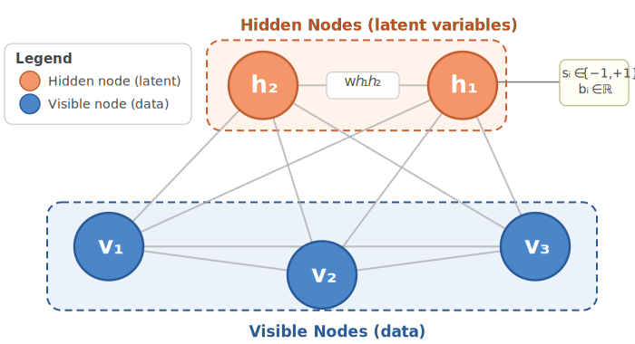
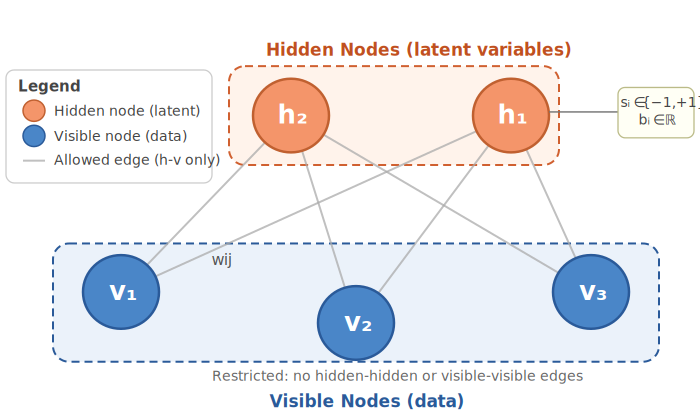

# L7c: Restricted Boltzmann Machines
In this lecture, we'll continue our discussion of Boltzmann Machines by introducing the __Restricted Boltzmann Machine (RBM)__. 

A Restricted Boltzmann Machine (RBM) is a simplified version of the general Boltzmann machine that removes connections between nodes in the same layer. This restriction creates a bipartite graph structure that enables efficient training and sampling algorithms.

> __Learning Objectives__
>
> * __Derive the training objective for a Boltzmann machine:__ Explain why minimizing KL divergence is equivalent to maximizing log-likelihood, and show how the gradient of the log-likelihood decomposes into a data term and a model term. Express the resulting weight update as the difference between data statistics and model statistics, and identify why computing the model term exactly is intractable for a fully connected network.
> * __Define a restricted Boltzmann machine and explain block Gibbs sampling:__ Describe the bipartite structure of an RBM, explain why conditional independence within each layer enables all units to be updated simultaneously, and write down the conditional probability expressions for hidden and visible units. Contrast this block update with node-by-node Gibbs sampling in the general Boltzmann machine and explain why the block update is more efficient.
> * __Explain and apply contrastive divergence (CD-$k$):__ Describe how CD-$k$ approximates the model expectation using $k$ block Gibbs steps, and apply the CD-1 algorithm to train an RBM on handwritten digit images. Identify the positive and negative phases of the CD-$k$ update rule, and explain what each phase represents in terms of data statistics and model statistics.

Let's get started!

___

## Examples
Today, we will use the following examples to illustrate key concepts:

> [▶ Training a Small Boltzmann Machine with CD-1](CHEME-5820-L7c-Example-Training-SmallBoltzmannMachine-Spring-2026.ipynb). Building on the sampling example from L7a, we now turn to training. We implement the CD-1 algorithm on a small Boltzmann machine, examine how reconstruction quality changes as training progresses, and explore what happens when we expand the training set with additional data.
___

    

      
    

  

## Review: Boltzmann Machines
Formally, [a Boltzmann Machine](https://en.wikipedia.org/wiki/Boltzmann_machine) $\mathcal{B}$ is a fully connected _undirected weighted graph_ defined by the tuple $\mathcal{B} = \left(\mathcal{V},\mathcal{E}, \mathbf{W},\mathbf{b}, \mathbf{s}\right)$.
* __Units__: Each unit (vertex, node, neuron) $v_{i}\in\mathcal{V}$ has a binary state (`on` or `off`) and a bias value 
$b_{i}\in\mathbb{R}$. The bias vector $\mathbf{b}\in\mathbb{R}^{|\mathcal{V}|}$ is the vector of bias values for all nodes in the network.
    - A machine $\mathcal{B}$ may have _visible_ nodes (the state is visible) and _hidden_ nodes (the state is not visible to us). The visible nodes represent the state of the data, while the hidden nodes capture the underlying structure of the data (latent variables).
    - The set of all nodes in the machine $\mathcal{B}$ is denoted by $\mathcal{V} \equiv \left\{v_{1},v_{2},\ldots,v_{|\mathcal{V}|}\right\}$, where $|\mathcal{V}|$ is the number of nodes in the network. We can partition the set of nodes into visible nodes $\mathcal{V}_{\text{vis}}$ and hidden nodes $\mathcal{V}_{\text{hid}}$, such that $\mathcal{V} = \mathcal{V}_{\text{vis}} \cup \mathcal{V}_{\text{hid}}$ and $\mathcal{V}_{\text{vis}} \cap \mathcal{V}_{\text{hid}} = \emptyset$.
* __Edges__: Each edge $e\in\mathcal{E}$ has a weight. The weight of the edge connecting $v_{i}\in\mathcal{V}$ and $v_{j}\in\mathcal{V}$, is denoted by $w_{ij}\in\mathbf{W}$, where the weight matrix $\mathbf{W}\in\mathbb{R}^{|\mathcal{V}|\times|\mathcal{V}|}$ is symmetric, i.e. $w_{ij} = w_{ji}$ and $w_{ii} = 0$ (no self loops). The weights $w_{ij}\in\mathbb{R}$ determine the strength of the connection between nodes $i$ and $j$. 
* __States__: The state of the machine $\mathcal{B}$ is represented by a binary vector $\mathbf{s}\in\mathbb{R}^{|\mathcal{V}|}$, where $s_{i}\in\{-1,1\}$ is the state of node $v_{i}$. When $s_{i} = 1$, the node is `on`, and when $s_{i} = -1$, the node is `off`. The set of all possible _state configurations_ is denoted by $\mathcal{S} \equiv \left\{\mathbf{s}^{(1)},\mathbf{s}^{(2)},\ldots,\mathbf{s}^{(N)}\right\}$, where $N$ is the number of possible state configurations, or $N = 2^{|\mathcal{V}|}$ for binary units.
___

## Theory: Training Boltzmann Machines
Up to this point we have not explored the optimization problem solved during training: how should the weights and biases, collected in $\boldsymbol{\theta} = \{\mathbf{W}, \mathbf{b}\}$, be chosen? The goal is to find parameters that make the machine assign high probability to the training patterns we actually observe.

Let the dataset be $\mathbf{X}=\left\{\mathbf{x}^{(1)},\mathbf{x}^{(2)},\dots,\mathbf{x}^{(m)}\right\}$ with $\mathbf{x}^{(r)}\in\{-1,1\}^{n}$, and let $\hat{p}_{\mathrm{data}}(\mathbf{v})$ be the empirical distribution — it simply counts how often each pattern appears in the training data. A natural objective is to minimize the Kullback–Leibler (KL) divergence between the training data distribution and the model's distribution $p_{\theta}(\mathbf{v})$:
$$
D_{\mathrm{KL}}(\hat p_{\mathrm{data}} \,\|\, p_\theta)
\equiv \sum_{\mathbf{v}}\hat p_{\mathrm{data}}(\mathbf{v})
\log\!\left(\frac{\hat p_{\mathrm{data}}(\mathbf{v})}{p_\theta(\mathbf{v})}\right).
$$
Expanding the logarithm splits the divergence into two terms: one that depends only on the data, and one that depends on both the data and the model:
$$
D_{\mathrm{KL}}(\hat p_{\mathrm{data}} \,\|\, p_\theta)
= \underbrace{\sum_{\mathbf{v}}\hat p_{\mathrm{data}}(\mathbf{v})\log \hat p_{\mathrm{data}}(\mathbf{v})}_{-H(\hat p_{\mathrm{data}})}
- \underbrace{\sum_{\mathbf{v}}\hat p_{\mathrm{data}}(\mathbf{v})\log p_\theta(\mathbf{v})}_{H(\hat p_{\mathrm{data}},\, p_\theta)}.
$$

> The first term, $-H(\hat{p}_{\mathrm{data}})$, is fixed — it does not depend on $\boldsymbol{\theta}$ at all. So minimizing the KL divergence over $\boldsymbol{\theta}$ reduces to maximizing the second term, which is the average log-probability the model assigns to the training data:
> $$
> \arg\min_\theta\, D_{\mathrm{KL}}(\hat p_{\mathrm{data}}\|p_\theta)
> =
> \arg\max_\theta\, \mathcal{L}(\theta),
> \qquad
> \mathcal{L}(\theta) \;:=\; \sum_{\mathbf{v}}\hat p_{\mathrm{data}}(\mathbf{v})\log p_\theta(\mathbf{v}).
> $$

To maximize $\mathcal{L}(\theta)$ we need an explicit formula for $p_\theta(\mathbf{v})$ — the probability the model assigns to a pattern $\mathbf{v}$. In a Boltzmann machine, every probability comes from an energy function. Splitting the units into the ones we observe (visible, $\mathbf{v}$) and the ones we don't (hidden, $\mathbf{h}$), the energy of any joint configuration $(\mathbf{v}, \mathbf{h})$ is:
$$
E_{\theta}(\mathbf{v},\mathbf{h})
= -\frac{1}{2}\sum_{i\neq j}w_{ij}s_i s_j - \sum_i b_i s_i,
\qquad \boldsymbol{\theta}=\{\mathbf{W},\mathbf{b}\}.
$$
Lower energy means higher probability. The Boltzmann distribution turns energies into probabilities via:
$$
p_{\theta}(\mathbf{v},\mathbf{h})=\frac{1}{Z_{\theta}}\exp\!\left(-\beta E_{\theta}(\mathbf{v},\mathbf{h})\right),
\qquad
Z_{\theta}=\sum_{\mathbf{v},\mathbf{h}}\exp\!\left(-\beta E_{\theta}(\mathbf{v},\mathbf{h})\right),
$$
where $Z_{\theta}$ is the normalizing constant — it is just a sum over every possible configuration $(\mathbf{v}, \mathbf{h})$ that ensures all probabilities add up to one. Since the hidden units are never observed, the probability the model assigns to a visible pattern $\mathbf{v}$ alone is obtained by summing over all possible hidden configurations:
$$
p_{\theta}(\mathbf{v})=\sum_{\mathbf{h}}p_{\theta}(\mathbf{v},\mathbf{h})
= \frac{1}{Z_{\theta}}\sum_{\mathbf{h}}\exp\!\left(-\beta E_{\theta}(\mathbf{v},\mathbf{h})\right).
$$

To maximize the likelihood, we use gradient ascent on $\mathcal{L}(\theta)$, which requires $\partial \log p_{\theta}(\mathbf{v})/\partial\boldsymbol{\theta}$. Taking the log of the expression above splits into two terms:
$$
\log p_{\theta}(\mathbf{v})
= \log\!\sum_{\mathbf{h}}e^{-\beta E_{\theta}(\mathbf{v},\mathbf{h})}
- \log Z_{\theta}.
$$
Differentiating the first term with respect to $\boldsymbol{\theta}$ — using the standard rule $\frac{d}{d\theta}\log f(\theta) = f'(\theta)/f(\theta)$ — pulls a factor of $p_{\theta}(\mathbf{h}\mid\mathbf{v})$ out of the sum. The result is a weighted average of the energy gradient, where the weights are the probabilities of each hidden configuration given the observed data:
$$
\frac{\partial}{\partial\theta}\log\!\sum_{\mathbf{h}}e^{-\beta E_{\theta}(\mathbf{v},\mathbf{h})}
= -\beta\sum_{\mathbf{h}}p_{\theta}(\mathbf{h}\mid\mathbf{v})\frac{\partial E_{\theta}(\mathbf{v},\mathbf{h})}{\partial\theta}.
$$
A weighted average of a quantity under a probability distribution is exactly what an expectation $\mathbb{E}[\cdot]$ means, so this term is $-\beta\,\mathbb{E}_{p_{\theta}(\mathbf{h}\mid\mathbf{v})}[\partial E / \partial\theta]$. Differentiating the second term, $\log Z_{\theta}$, by the same rule gives a weighted average over all configurations the model can generate:
$$
\frac{\partial}{\partial\theta}\log Z_{\theta}
= -\beta\sum_{\mathbf{v},\mathbf{h}}p_{\theta}(\mathbf{v},\mathbf{h})\frac{\partial E_{\theta}(\mathbf{v},\mathbf{h})}{\partial\theta}
= -\beta\,\mathbb{E}_{p_{\theta}(\mathbf{v},\mathbf{h})}\!\left[\frac{\partial E_{\theta}(\mathbf{v},\mathbf{h})}{\partial\theta}\right].
$$
Putting both terms together, the gradient of the log-likelihood for a single training pattern is:
$$
\frac{\partial\log p_{\theta}(\mathbf{v})}{\partial\theta}
= -\beta\,\mathbb{E}_{p_{\theta}(\mathbf{h}\mid\mathbf{v})}\!\left[\frac{\partial E_{\theta}}{\partial\theta}\right]
+ \beta\,\mathbb{E}_{p_{\theta}(\mathbf{v},\mathbf{h})}\!\left[\frac{\partial E_{\theta}}{\partial\theta}\right].
$$
The first expectation is computed with the visible units clamped to the training pattern $\mathbf{v}$ — it reflects what the data says. The second expectation is computed by letting the model run freely over all $(\mathbf{v}, \mathbf{h})$ — it reflects what the model currently believes. Because the energy is linear in the parameters, i.e., $E_{\theta}(\mathbf{s})=-\sum_k\theta_k f_k(\mathbf{s})$, this further simplifies to:
$$
\frac{\partial\log p_{\theta}(\mathbf{v})}{\partial\theta_k}
=\beta\left(\langle f_k\rangle_{\text{data}}-\langle f_k\rangle_{\text{model}}\right).
$$

> This is the entire training story: nudge each parameter upward when the data implies it should be larger than the model currently thinks, and downward otherwise. Training is done when both sides agree.

The catch is computational. The "model" average $\langle f_k\rangle_{\text{model}}$ requires drawing samples from the model's own distribution, which means running a Markov chain until it mixes — a costly operation that must be repeated at every parameter update in a fully connected network. This is exactly why we next introduce the _restricted_ structure of an RBM, which makes each sampling step cheap and enables the practical CD-$k$ approximation.

> [▶ Advanced: Training Boltzmann Machines](CHEME-5820-L7a-Advanced-Training-BoltzmannMachines-Spring-2026.ipynb). A deeper look at the training algorithm, including a more detailed derivation of the contrastive divergence update rules.

A worked example applies these ideas directly:

> [▶ Training a Small Boltzmann Machine with CD-1](CHEME-5820-L7c-Example-Training-SmallBoltzmannMachine-Spring-2026.ipynb). We implement the CD-1 algorithm on a small Boltzmann machine, examine how reconstruction quality changes as training progresses, and explore what happens when we expand the training set with additional data.

With the training objective in hand, we now turn to the restricted structure that makes computing the model term tractable.

___

    

      
    

## Restricted Boltzmann Machines (RBMs)
A general Boltzmann machine is a fully connected undirected graph where every node connects to every other node. A Restricted Boltzmann Machine simplifies this structure by organizing nodes into two layers: a visible layer and a hidden layer, with connections only between layers.

Formally, an RBM is defined by the tuple $\mathcal{R} = \left(\mathcal{V}, \mathcal{H}, \mathbf{W}, \mathbf{a}, \mathbf{b}\right)$:

* **Visible layer** $\mathcal{V}$: The set of visible units $\left\{v_{1}, v_{2}, \ldots, v_{n}\right\}$ where $n = |\mathcal{V}|$. Each visible unit has a binary state $v_{i} \in \{-1, 1\}$ and a bias $a_{i} \in \mathbb{R}$. The bias vector is $\mathbf{a} \in \mathbb{R}^{n}$.
* **Hidden layer** $\mathcal{H}$: The set of hidden units $\left\{h_{1}, h_{2}, \ldots, h_{m}\right\}$ where $m = |\mathcal{H}|$. Each hidden unit has a binary state $h_{j} \in \{-1, 1\}$ and a bias $b_{j} \in \mathbb{R}$. The bias vector is $\mathbf{b} \in \mathbb{R}^{m}$.
* **Weight matrix** $\mathbf{W} \in \mathbb{R}^{n \times m}$: The weight $w_{ij}$ represents the connection strength between visible unit $v_{i}$ and hidden unit $h_{j}$.

The restriction is that there are no connections within the visible layer (no $v_{i}$-$v_{j}$ edges) and no connections within the hidden layer (no $h_{i}$-$h_{j}$ edges). This bipartite structure is the source of the name "restricted," and it is precisely this structure that makes efficient training possible.

### Sampling an RBM (Block Gibbs)
In the general Boltzmann machine, Gibbs sampling updates one node at a time: pick a node, compute its conditional probability given every other node, and sample. This is slow because every node is coupled to every other node.

The RBM's bipartite structure changes this entirely. Because there are no connections within a layer, every hidden unit is conditionally independent of every other hidden unit given the visible layer — and vice versa. This means all hidden units can be updated simultaneously in one block, and all visible units in the next. This is called **block Gibbs sampling**.

The total input to hidden unit $h_{j}$ from the visible layer is $\sum_{i}w_{ij}v_{i} + b_{j}$, which in matrix form is $(\mathbf{W}^{\top}\mathbf{v})_{j} + b_{j}$. The probability that $h_{j}$ is `on` given the current visible state $\mathbf{v}$ follows the same logistic form as the general Boltzmann machine, but now the sum runs only over the visible-to-hidden connections:
$$
P\!\left(h_{j}=1 \mid \mathbf{v}\right) = \frac{1}{1+\exp\!\left(-2\beta\left((\mathbf{W}^{\top}\mathbf{v})_{j}+b_{j}\right)\right)}.
$$
Symmetrically, the total input to visible unit $v_{i}$ from the hidden layer is $(\mathbf{W}\mathbf{h})_{i} + a_{i}$, and the probability that $v_{i}$ is `on` given the current hidden state $\mathbf{h}$ is:
$$
P\!\left(v_{i}=1 \mid \mathbf{h}\right) = \frac{1}{1+\exp\!\left(-2\beta\left((\mathbf{W}\mathbf{h})_{i}+a_{i}\right)\right)}.
$$
Because all units in a layer are conditionally independent, both of these updates can be computed in parallel across all units in the layer at once — this is the key computational advantage of the RBM structure.

**Algorithm (Block Gibbs Sampling)**

__Initialize__: choose parameters $\mathbf{W}$, $\mathbf{a}$, $\mathbf{b}$; an initial visible state $\mathbf{v}^{(0)} \in \{-1, 1\}^{n}$; inverse temperature $\beta > 0$; and the number of turns $T$.

For each turn $t = 1, 2, \dots, T$:
1. For each hidden unit $h_{j}$, compute $P(h_{j}^{(t)} = 1 \mid \mathbf{v}^{(t-1)})$ using the expression above, then sample $h_{j}^{(t)} \in \{-1, 1\}$ from a Bernoulli distribution with that probability. All hidden units are sampled simultaneously.
2. For each visible unit $v_{i}$, compute $P(v_{i}^{(t)} = 1 \mid \mathbf{h}^{(t)})$ using the expression above, then sample $v_{i}^{(t)} \in \{-1, 1\}$ from a Bernoulli distribution with that probability. All visible units are sampled simultaneously.
3. Store $(\mathbf{v}^{(t)}, \mathbf{h}^{(t)})$ and proceed to the next turn.

After $T$ turns, the chain $\left\{(\mathbf{v}^{(t)}, \mathbf{h}^{(t)})\right\}_{t=1}^{T}$ converges to samples from the model distribution $p_\theta(\mathbf{v}, \mathbf{h})$.

### Contrastive Divergence (CD-$k$)
Running block Gibbs to convergence at every parameter update is still expensive. Hinton's key practical insight — contrastive divergence — is that you do not need the chain to mix fully. Instead, run only $k$ block Gibbs steps (typically $k=1$ works well in practice) starting from the training pattern itself, and use the result as a cheap approximation to the model's distribution. The gradient approximation from the training theory then becomes:

$$
\Delta\mathbf{W} \approx \eta\left(\langle\mathbf{v}\mathbf{h}^{\top}\rangle^{+}-\langle\mathbf{v}\mathbf{h}^{\top}\rangle^{-}\right),
$$

where $\langle\mathbf{v}\mathbf{h}^{\top}\rangle^{+}$ is computed with the visible units clamped to the training pattern (the **positive phase** — what the data says), and $\langle\mathbf{v}\mathbf{h}^{\top}\rangle^{-}$ is computed after $k$ block Gibbs steps starting from that pattern (the **negative phase** — a short approximation of what the model believes).

**Algorithm (CD-$k$)**

__Initialize__: set $\mathbf{W}$, $\mathbf{a}$, $\mathbf{b}$ to small random values; choose learning rate $\eta > 0$, inverse temperature $\beta = 1$, Gibbs depth $k \geq 1$, tolerance $\epsilon > 0$, and maximum epochs $N_{\text{epochs}}$.

For each epoch $e = 1, 2, \dots, N_{\text{epochs}}$, and for each training pattern $\mathbf{x}^{(r)} \in \mathbf{X}$:
1. **Positive phase**: clamp the visible units to the training pattern, $\mathbf{v}^{(0)} = \mathbf{x}^{(r)}$. Compute $p_{j}^{+} = P(h_{j}=1 \mid \mathbf{v}^{(0)})$ for all $j$, and sample $\mathbf{h}^{(0)} \sim P(\mathbf{h} \mid \mathbf{v}^{(0)})$. Form the data-driven correlation $\langle v_{i} h_{j}\rangle^{+} = v_{i}^{(0)}\,p_{j}^{+}$.
2. **Negative phase**: run $k$ block Gibbs steps — alternately sample $\mathbf{v}^{(t)} \sim P(\mathbf{v} \mid \mathbf{h}^{(t-1)})$ then $\mathbf{h}^{(t)} \sim P(\mathbf{h} \mid \mathbf{v}^{(t)})$ for $t = 1, \dots, k$. Compute $p_{j}^{-} = P(h_{j}=1 \mid \mathbf{v}^{(k)})$ and form $\langle v_{i} h_{j}\rangle^{-} = v_{i}^{(k)}\,p_{j}^{-}$.
3. **Update**: use the difference between the positive and negative phases to update all parameters:
$$
\mathbf{W}\leftarrow\mathbf{W}+\eta\left(\langle\mathbf{v}\mathbf{h}^{\top}\rangle^{+}-\langle\mathbf{v}\mathbf{h}^{\top}\rangle^{-}\right)
$$
$$
\mathbf{a}\leftarrow\mathbf{a}+\eta\left(\langle\mathbf{v}\rangle_{\text{data}}-\langle\mathbf{v}\rangle_{\text{model}}\right),\qquad
\mathbf{b}\leftarrow\mathbf{b}+\eta\left(\langle\mathbf{h}\rangle_{\text{data}}-\langle\mathbf{h}\rangle_{\text{model}}\right).
$$
4. Check stopping criteria. If any criterion is met, stop; otherwise continue.

**Stopping Criteria**

Training is stopped when the parameter updates become negligible — the model has essentially converged. This can be checked in three ways:
- **Parameter change**: $\|\Delta\mathbf{W}\|_{F} < \epsilon$, $\|\Delta\mathbf{a}\|_{2} < \epsilon$, and $\|\Delta\mathbf{b}\|_{2} < \epsilon$.
- **Correlation matching**: the positive and negative phase correlations agree, $\max_{i,j}\left|\langle v_{i}h_{j}\rangle^{+} - \langle v_{i}h_{j}\rangle^{-}\right| < \epsilon$, and similarly for the visible and hidden bias updates.
- **Fixed budget**: stop after $N_{\text{epochs}}$ epochs regardless.

> CD-$k$ trades exactness for speed. The negative phase samples do not come from the true model distribution — they come from a chain that has only taken $k$ steps. In practice, $k=1$ often works well, and the resulting weight updates are a useful (if biased) approximation to the true gradient.

___

## Lab
In the lab this week, we examine how the learned weight structure and reconstruction quality evolve as CD-1 training progresses, and explore how the model responds when the training set is expanded.

## Summary
This module derived the training objective for Boltzmann machines, introduced the Restricted Boltzmann Machine as a tractable special case, and developed the block Gibbs sampling and CD-$k$ algorithms that make training practical.

> __Key Takeaways:__
>
> * **Training as likelihood maximization:** Minimizing KL divergence between the data distribution and the model is equivalent to maximizing log-likelihood. The gradient of the log-likelihood decomposes into a data term (what we observe) and a model term (what the model generates), and training drives these two terms to match.
> * **RBM structure enables parallel updates:** Removing within-layer connections means all hidden units are conditionally independent given the visible layer, and vice versa. This lets us update an entire layer simultaneously, replacing slow node-by-node Gibbs sampling with efficient block updates.
> * **CD-$k$ approximates the model term cheaply:** Instead of running a Markov chain to stationarity to estimate the model expectation, CD-$k$ runs only $k$ block Gibbs steps starting from the training pattern. The result is a biased but practical gradient approximation that works well in practice, especially for $k=1$.

Applying CD-1 to handwritten digit images shows how an RBM can learn compact representations of structured data from raw pixel values.

___
