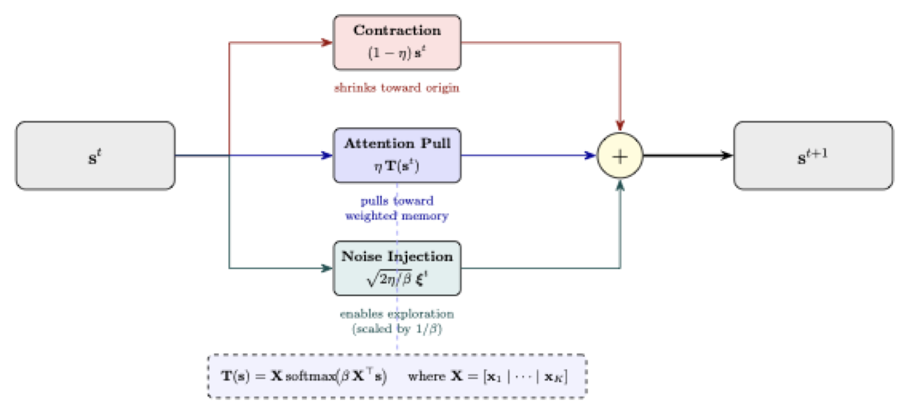
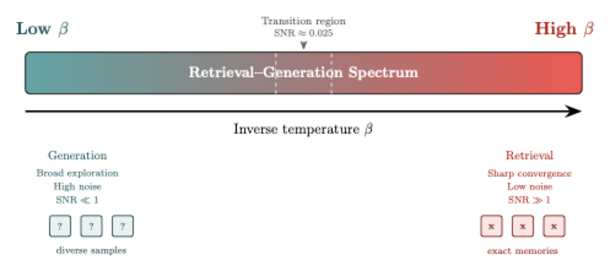

# L8a: Energy Methods in Generative AI
In the previous lectures, we studied three energy-based architectures: classical Hopfield networks, modern Hopfield networks, and Boltzmann machines. Each defines an energy function over states, but they use it differently: Hopfield networks minimize energy to retrieve stored patterns, while Boltzmann machines sample from a distribution shaped by energy. In this lecture, we unify these ideas under the framework of energy-based models (EBMs) and show how adding noise to gradient-based retrieval produces a stochastic attention mechanism that interpolates between retrieval and generation.

> __Learning Objectives:__
> 
> By the end of this lecture, you should be able to define and explain:
>
> * __Energy-Based Models as a Unifying Framework:__ Describe how classical Hopfield networks, modern Hopfield networks, and Boltzmann machines are all instances of the same energy-based modeling framework, differing only in their energy function and inference strategy (minimization vs. sampling).
> * __Langevin Dynamics for Stochastic Attention:__ Explain how adding calibrated noise to the modern Hopfield gradient descent update produces a Langevin dynamics sampler, and describe the roles of the three terms in the update rule: contraction, attention pull, and noise injection.
> * __The Retrieval-Generation Spectrum:__ Describe how the inverse temperature parameter $\beta$ controls whether the system performs sharp memory retrieval (high $\beta$) or diverse sample generation (low $\beta$), and identify the conditions under which the Langevin sampler converges to the Boltzmann distribution over the Hopfield energy landscape.

Let's get started!
___

## Examples
Today, we will use the following examples to illustrate key concepts:

> [▶ Let's look at a small stochastic attention model](CHEME-5820-L8a-Example-StochasticAttention-MNIST-Spring-2026.ipynb). This example demonstrates how adding noise to the modern Hopfield update produces a stochastic attention mechanism that can generate diverse samples from the memory patterns. This approach can operate in a retrieval mode (high $\beta$) or a generative mode (low $\beta$), illustrating the retrieval-generation spectrum.
___

## Review: The Energy Perspective
Over the past two weeks, we have built three energy-based architectures. Each defines an energy function over states and uses it to drive computation. Let's briefly recall the key ideas before unifying them.

> **Classical Hopfield networks** define a quadratic energy over binary states $\mathbf{s}\in\{-1,1\}^{N}$:
> $$E(\mathbf{s}) = -\frac{1}{2}\mathbf{s}^{\top}\mathbf{W}\mathbf{s} - \mathbf{b}^{\top}\mathbf{s}$$
> where $\mathbf{W}\in\mathbb{R}^{N\times N}$ is the symmetric weight matrix (with zero diagonal) and $\mathbf{b}\in\mathbb{R}^{N}$ is the bias vector. Memory retrieval proceeds by asynchronous updates that greedily decrease the energy until the network reaches a fixed point. The stored patterns are local minima of this energy surface.

Classical Hopfield networks are limited to binary patterns and have a storage capacity of approximately $0.138N$ patterns. Modern Hopfield networks address both limitations.

> **Modern Hopfield networks** replace the quadratic energy with a log-sum-exp (LSE) energy over continuous states $\mathbf{s}\in\mathbb{R}^{N}$:
> $$E(\mathbf{s}) = -\operatorname{lse}_{\beta}(\mathbf{X}^{\top}\mathbf{s}) + \frac{1}{2}\lVert\mathbf{s}\rVert_{2}^{2} + \frac{1}{\beta}\log K + \frac{1}{2}M^{2}$$
> where $\mathbf{X}\in\mathbb{R}^{N\times K}$ is the memory matrix, $\beta>0$ is the inverse temperature, and $M = \max_{i}\lVert\mathbf{m}_{i}\rVert_{2}$. The retrieval map $\mathbf{T}(\mathbf{s}) = \mathbf{X}\operatorname{softmax}(\beta\mathbf{X}^{\top}\mathbf{s})$ is gradient descent on this energy with step size $1$, since $\nabla E(\mathbf{s}) = \mathbf{s} - \mathbf{T}(\mathbf{s})$.

Modern Hopfield networks store continuous patterns with exponential capacity and converge rapidly. However, both classical and modern Hopfield networks are *deterministic*: they retrieve, but they do not generate.

> **Boltzmann machines** use the same quadratic energy as classical Hopfield networks but replace deterministic minimization with *stochastic sampling*. Each node updates its state by sampling from a logistic distribution parameterized by the energy contribution. After sufficient iterations, the sampled states converge to the Boltzmann distribution $P(\mathbf{s}) \propto \exp(-\beta\,E(\mathbf{s}))$.

The key observation is that Hopfield networks and Boltzmann machines share the same energy landscape but differ in how they traverse it: Hopfield retrieves by descending, Boltzmann generates by sampling. This duality is the starting point for a unified framework. For a side-by-side comparison of energy functions, gradients, and update rules, see [▶ Advanced: Energy Landscape Comparison](CHEME-5820-L8a-Advanced-EnergyLandscape-Comparison-Spring-2026.ipynb).
___

## Energy-Based Models: The General Framework
The three architectures above are all instances of a single framework: energy-based models (EBMs). An EBM defines a scalar energy function $E:\mathbb{R}^{N}\to\mathbb{R}$ that assigns low energy to desirable configurations and high energy to undesirable ones. The energy function induces a probability distribution over states via the Boltzmann distribution.

> **Definition (Energy-Based Model).**
> An energy-based model is defined by an energy function $E:\mathbb{R}^{N}\to\mathbb{R}$ and an inverse temperature $\beta > 0$. The model assigns probability to each state $\mathbf{s}\in\mathbb{R}^{N}$ via:
> $$P_{\beta}(\mathbf{s}) = \frac{1}{Z(\beta)}\exp\left(-\beta\,E(\mathbf{s})\right)$$
> where $Z(\beta) = \int\exp(-\beta\,E(\mathbf{s}))\,d\mathbf{s}$ is the partition function (or $Z(\beta) = \sum_{\mathbf{s}}\exp(-\beta\,E(\mathbf{s}))$ for discrete states). The partition function ensures the distribution normalizes to $1$.

The partition function $Z(\beta)$ is generally intractable to compute. This is a central challenge in EBMs. Given an energy function, there are two fundamental operations:

> **Minimization (Retrieval).** Find the state that minimizes the energy:
> $$\mathbf{s}^{\ast} = \arg\min_{\mathbf{s}} E(\mathbf{s})$$
> This is what Hopfield networks do. Gradient descent on $E$ drives the state toward a local minimum, which corresponds to a stored memory. As $\beta\to\infty$, the Boltzmann distribution concentrates on energy minima, so minimization is the zero-temperature limit of sampling.

Minimization produces a single answer. Sampling produces a distribution of answers.

> **Sampling (Generation).** Draw states from the Boltzmann distribution $P_{\beta}(\mathbf{s})\propto\exp(-\beta\,E(\mathbf{s}))$. This is what Boltzmann machines do. At finite temperature ($\beta < \infty$), samples explore multiple modes of the energy landscape rather than collapsing to a single minimum.

The unifying lens is this: *retrieval and generation are endpoints of a spectrum controlled by $\beta$*. At high $\beta$ (low temperature), the distribution is concentrated on energy minima and the model retrieves. At low $\beta$ (high temperature), the distribution spreads and the model generates diverse outputs. The question is: can we build a sampler for the *modern Hopfield* energy that gives us this full spectrum?
___

## From Retrieval to Generation: Langevin Dynamics
We already know the gradient of the modern Hopfield energy. From L6c:
$$\nabla E(\mathbf{s}) = \mathbf{s} - \mathbf{T}(\mathbf{s})$$
where $\mathbf{T}(\mathbf{s}) = \mathbf{X}\operatorname{softmax}(\beta\mathbf{X}^{\top}\mathbf{s})$ is the retrieval map. Deterministic retrieval is gradient descent on this energy:
$$\mathbf{s}^{t+1} = \mathbf{s}^{t} - \eta\nabla E(\mathbf{s}^{t}) = (1-\eta)\mathbf{s}^{t} + \eta\,\mathbf{T}(\mathbf{s}^{t})$$
This drives the state to a local energy minimum. To turn retrieval into generation, we add noise.

> **Langevin dynamics** is a general-purpose method for sampling from a distribution $P(\mathbf{s})\propto\exp(-\beta\,E(\mathbf{s}))$ using only the gradient $\nabla E(\mathbf{s})$. The discrete-time update (Unadjusted Langevin Algorithm, ULA) is:
> $$\mathbf{s}^{t+1} = \mathbf{s}^{t} - \eta\nabla E(\mathbf{s}^{t}) + \sqrt{\frac{2\eta}{\beta}}\,\boldsymbol{\xi}^{t}$$
> where $\boldsymbol{\xi}^{t}\sim\mathcal{N}(\mathbf{0},\mathbf{I}_{N})$ is standard Gaussian noise and $\eta > 0$ is the step size. As $\eta\to 0$ and the number of steps grows, the iterates converge in distribution to $P_{\beta}(\mathbf{s})\propto\exp(-\beta\,E(\mathbf{s}))$.

Substituting the modern Hopfield gradient $\nabla E(\mathbf{s}) = \mathbf{s} - \mathbf{T}(\mathbf{s})$ into the Langevin update gives the stochastic attention update rule.

> **Stochastic Attention Update (Algorithm 1).** Given the memory matrix $\mathbf{X}\in\mathbb{R}^{N\times K}$, inverse temperature $\beta > 0$, step size $\eta\in(0,1]$, and initial state $\mathbf{s}^{0}\in\mathbb{R}^{N}$, repeat for $t = 0,1,2,\ldots$:
> $$\boxed{\mathbf{s}^{t+1} = \underbrace{(1-\eta)\mathbf{s}^{t}}_{\text{contraction}} + \underbrace{\eta\,\mathbf{X}\operatorname{softmax}(\beta\mathbf{X}^{\top}\mathbf{s}^{t})}_{\text{attention pull}} + \underbrace{\sqrt{\frac{2\eta}{\beta}}\,\boldsymbol{\xi}^{t}}_{\text{noise injection}}}$$
> where $\boldsymbol{\xi}^{t}\sim\mathcal{N}(\mathbf{0},\mathbf{I}_{N})$.

The update has three terms, each with a distinct role.

> **The three terms:**
> * **Contraction** $(1-\eta)\mathbf{s}^{t}$: Shrinks the current state toward the origin. This term prevents the state from drifting and provides regularization. When $\eta = 1$, the current state is discarded entirely; when $\eta < 1$, the state retains partial memory of its previous position.
> * **Attention pull** $\eta\,\mathbf{T}(\mathbf{s}^{t})$: Pulls the state toward a softmax-weighted average of stored memories. This is the same retrieval force as in deterministic modern Hopfield, directing the state toward energy minima. The attention weights $\operatorname{softmax}(\beta\mathbf{X}^{\top}\mathbf{s}^{t})$ determine which memories exert the strongest pull.
> * **Noise injection** $\sqrt{2\eta/\beta}\,\boldsymbol{\xi}^{t}$: Adds Gaussian perturbation scaled by the temperature. This term prevents collapse to a single minimum and enables exploration of the energy landscape. The noise amplitude $\sqrt{2\eta/\beta}$ is calibrated so that the long-run distribution matches the Boltzmann distribution over the Hopfield energy.

The parameter $\beta$ controls the balance between retrieval and generation.

> **The role of $\beta$:**
> * **High $\beta$ (low temperature):** The softmax sharpens toward the nearest memory, and the noise amplitude $\sqrt{2\eta/\beta}$ shrinks. The system behaves like deterministic retrieval, converging to a single memory.
> * **Low $\beta$ (high temperature):** The softmax flattens and the noise amplitude grows. The system explores broadly, generating diverse samples that mix multiple memories.
> * **Intermediate $\beta$:** The system produces samples concentrated around energy minima but with controlled diversity. This is the regime of interest for generation tasks.

The figure below summarizes this retrieval-generation spectrum controlled by $\beta$.

For the continuous-time SDE formulation and regularity conditions, see [▶ Advanced: Langevin Dynamics and Convergence](CHEME-5820-L8a-Advanced-LangevinDynamics-Convergence-Spring-2026.ipynb).

Let's take a look at an example of this stochastic attention mechanism in action.

> [▶ Let's look at a small stochastic attention model](CHEME-5820-L8a-Example-StochasticAttention-MNIST-Spring-2026.ipynb). This example demonstrates how adding noise to the modern Hopfield update produces a stochastic attention mechanism that can generate diverse samples from the memory patterns. This approach can operate in a retrieval mode (high $\beta$) or a generative mode (low $\beta$), illustrating the retrieval-generation spectrum.
___

## Properties
The stochastic attention sampler inherits favorable properties from the modern Hopfield energy. We state the key results here; for full derivations and regularity conditions, see [▶ Advanced: Langevin Dynamics and Convergence](CHEME-5820-L8a-Advanced-LangevinDynamics-Convergence-Spring-2026.ipynb).

> **Convergence guarantee.** The modern Hopfield energy $E(\mathbf{s})$ is smooth (its gradient is Lipschitz continuous) and confining (it grows as $\lVert\mathbf{s}\rVert_{2}\to\infty$). Under these conditions, the Unadjusted Langevin Algorithm converges to the Boltzmann distribution $P_{\beta}(\mathbf{s})\propto\exp(-\beta\,E(\mathbf{s}))$ at a rate controlled by the step size $\eta$ and the spectral properties of the memory matrix. The convergence rate is quantified in the advanced notebook.

The key structural property is dissipativity: the energy pushes states back toward the convex hull of the stored memories. This prevents the Langevin iterates from escaping to infinity and ensures the stationary distribution is well-defined.

> **Strong log-concavity condition.** When $\beta\cdot\sigma_{\max}^{2}(\mathbf{X}) < 2$, where $\sigma_{\max}(\mathbf{X})$ is the largest singular value of the memory matrix, the energy $E$ is strongly convex. In this regime, the Boltzmann distribution is log-concave and the Langevin sampler converges exponentially fast to a *unique* stationary distribution. Outside this regime, convergence still occurs but may be slower and the stationary distribution may be multimodal.

A distinguishing feature of this approach is that no training is required.

> **No learned score function.** Unlike diffusion models, which learn a score function $\nabla\log p(\mathbf{s})$ from data, the stochastic attention sampler uses the *exact* gradient of the Hopfield energy. The memories $\mathbf{X}$ are stored directly, not learned. This makes the method training-free but limits it to generation conditioned on stored memories.
___

## The Bigger Picture
The stochastic attention sampler is one instance of a broader class of methods that use energy functions or score functions for generation. Several related frameworks share the same conceptual foundation.

> **Related frameworks:**
> * **Score-based diffusion models** ([Song et al., 2020](https://arxiv.org/abs/2011.13456)) also use Langevin dynamics for sampling, but they learn the score function $\nabla\log p(\mathbf{s})$ from data using a neural network. The stochastic attention sampler replaces the learned score with the exact Hopfield energy gradient, trading generality for exactness and eliminating the need for training.
> * **Variational autoencoders (VAEs)** define an energy implicitly through an encoder-decoder architecture and optimize a variational lower bound on the log-likelihood. Unlike Langevin-based methods, VAEs use amortized inference rather than iterative sampling.
> * **The Energy Transformer** ([Hoover et al., 2024](https://arxiv.org/abs/2302.07253)) replaces the standard transformer attention mechanism with an energy-based iteration, making each layer an energy-descent step. This connects the Hopfield-attention correspondence to full transformer architectures.

The classical Hopfield-Boltzmann duality (same energy, different inference) now extends to the modern continuous setting: the modern Hopfield energy supports both gradient-descent retrieval and Langevin sampling, unifying associative memory and generative modeling within a single energy landscape.
___

## Lab
In the lab, we will implement the stochastic attention update (Algorithm 1) and apply it to a memory retrieval and generation task. We'll sweep the inverse temperature parameter $\beta$ to explore the retrieval-to-generation spectrum: at high $\beta$ the sampler reproduces deterministic Hopfield retrieval, and at low $\beta$ it generates diverse samples that mix stored memories.

## Summary
This lecture unified classical Hopfield networks, modern Hopfield networks, and Boltzmann machines under the energy-based model framework and introduced stochastic attention via Langevin dynamics as a method for sampling from the modern Hopfield energy landscape.

> __Key Takeaways:__
>
> * **Energy-based models unify retrieval and generation:** Classical Hopfield, modern Hopfield, and Boltzmann machines all define energy functions over states. They differ in inference strategy: Hopfield networks minimize energy (retrieval), Boltzmann machines sample from the Boltzmann distribution (generation), and both are special cases of the EBM framework.
> * **Langevin dynamics turns attention into a sampler:** Adding calibrated Gaussian noise to the modern Hopfield gradient descent update produces the stochastic attention rule, which has three terms: contraction, attention pull, and noise injection. The noise amplitude is set so that the long-run distribution matches the Boltzmann distribution over the Hopfield energy.
> * **The inverse temperature $\beta$ controls a retrieval-generation spectrum:** At high $\beta$, the sampler behaves like deterministic retrieval and converges to a single stored memory. At low $\beta$, it generates diverse samples by exploring the energy landscape. The transition between these regimes is smooth and controlled by a single parameter.

The stochastic attention framework connects associative memory theory to modern generative modeling and provides a foundation for understanding score-based and energy-based generation methods.
___

## References
Background reading for this lecture can be found from the following sources:
* [Hopfield, J.J. (1982). Neural networks and physical systems with emergent collective computational abilities. Proceedings of the National Academy of Sciences, 79(8), 2554-2558.](https://www.pnas.org/doi/10.1073/pnas.79.8.2554)
* [Ramsauer, H., Schafl, B., Lehner, J., Seidl, P., Widrich, M., Gruber, L., Holzleitner, M., Pavlovic, M., Sandve, G.K., Greiff, V., Kreil, D.P., Kopp, M., Klambauer, G., Brandstetter, J., & Hochreiter, S. (2020). Hopfield Networks is All You Need. ArXiv, abs/2008.02217.](https://arxiv.org/abs/2008.02217)
* [LeCun, Y., Chopra, S., Hadsell, R., Ranzato, M.A., & Huang, F.J. (2006). A Tutorial on Energy-Based Learning. In Predicting Structured Data, MIT Press.](http://yann.lecun.com/exdb/publis/pdf/lecun-06.pdf)
* [Song, Y., Sohl-Dickstein, J., Kingma, D.P., Kumar, A., Ermon, S., & Poole, B. (2020). Score-Based Generative Modeling through Stochastic Differential Equations. ArXiv, abs/2011.13456.](https://arxiv.org/abs/2011.13456)
* [Hoover, B., Liang, Y., Pham, B., Panda, R., Strobelt, H., Chau, D.H., Zaki, M.J., & Krotov, D. (2024). Energy Transformer. ArXiv, abs/2302.07253.](https://arxiv.org/abs/2302.07253)
* [Varner, J.D. et al. (2026). Stochastic Attention via Langevin Dynamics on the Modern Hopfield Energy Landscape.](https://github.com/varnerlab/stochastic-attention-study-paper)
___
