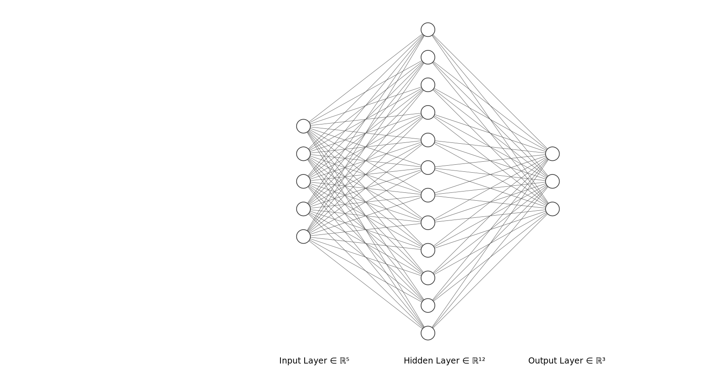

# L8c: Feedforward Neural Networks (FNNs)
In this lecture, we introduce feedforward neural networks (FNNs), artificial neural network architectures where connections between layers do not form cycles. This differs from recurrent neural networks (RNNs), where data can flow in cycles.

> __Learning Objectives:__
> 
> By the end of this lecture, you will be able to:
>
> * __FNN Architecture__: Define feedforward neural networks as layered structures where information flows from input nodes through hidden layers to output nodes without cycles. Understand that each node applies a linear transformation followed by a non-linear activation function.
> * __FNN as Function Composition__: Describe how an FNN computes a mapping from inputs to outputs as a series of function compositions, where each layer transforms the output of the previous layer.
> * __FNN Training__: Explain how FNNs are trained using backpropagation, which computes gradients of a loss function with respect to network parameters using the chain rule, enabling gradient descent optimization.

Let's get started!
___

## Examples
Today, we will use the following examples to illustrate key concepts:

> [▶ Let's look at a multiclass classification example](CHEME-5820-L8c-Example-FNN-ImageClassification-Spring-2026.ipynb). This example demonstrates how we can use a feedforward neural network to classify images of handwritten digits from the MNIST dataset. We will see how to define the architecture of the FNN, train it using backpropagation, and evaluate its performance on the test set.
___

  

    
  

## Feedforward Neural Networks
Consider the network shown above. The network has three layers: an input layer (five nodes), a hidden layer (twelve nodes), and an output layer (three nodes). 

* __Input layer__: The input layer receives raw data, with each node representing one feature of the input vector. It does not perform computation—its role is to pass input values to the next layer.
*  __Hidden layer(s)__: The hidden layer performs computations on the input data. Each node takes the output of the previous layer and applies a linear transformation followed by a non-linear activation function. The output of each node passes to the next layer. The number of nodes and layers can vary depending on the task complexity. Networks with multiple hidden layers are called _deep neural networks_.
* __Output layer__: The output layer produces the network output $\mathbf{y} = (y_{1},y_{2},\dots,y_{k})$ where $\mathbf{y}\in\mathbb{R}^{k}$. Each node takes output from the hidden layer and applies a linear transformation followed by an activation function. For multi-class classification, the output can be interpreted as probabilities for each class using softmax.

### Function Composition
Suppose we have a feedforward neural network with $L$ layers. The network has $d_{in}$ input nodes (layer 0), $i=1,2,\dots, L-1$ hidden layers where hidden layer $i$ has $m_{i}$ nodes, and the output layer $L$ has $d_{out}$ nodes. Each hidden layer is fully connected to the previous and subsequent layers (no connections within a layer and no self-connections). Information flows from input to output, forming a feedforward structure.

#### Inputs, Outputs, and Parameters
* __Inputs and outputs__: Let $\mathbf{x} = (x_{1},x_{2},\dots,x_{d_{in}},1)^{\top}$ be the _augmented_ input vector, where the extra `1` allows the bias term to be included in the weight vector. Let $\mathbf{z}^{(i)} = (z^{(i)}_{1},z^{(i)}_{2},\dots,z^{(i)}_{m_{i}})^{\top}$ be the output vector of layer $i$. Before passing to the next layer, $\mathbf{z}^{(i)}$ is augmented with a $1$ to form $\tilde{\mathbf{z}}^{(i)} = (z^{(i)}_{1},\dots,z^{(i)}_{m_{i}},1)^{\top}\in\mathbb{R}^{m_{i}+1}$, preserving the inner product interpretation at every layer. Note that $\tilde{\mathbf{z}}^{(0)} = \mathbf{x}$ is already augmented. Finally, let $\hat{\mathbf{y}}= (y_{1},y_{2},\dots,y_{d_{out}})^{\top}$ be the predicted output vector.

* __Parameters__: Each node $j=1,2,\dots,m_{i}$ in layer $i\geq{1}$ has a parameter vector $\mathbf{w}^{(i)}_{j} = (w^{(i)}_{j,1},w^{(i)}_{j,2},\dots,w^{(i)}_{j,m_{i-1}}, b^{(i)}_{j})^{\top}$, where $w^{(i)}_{j,k}\in\mathbb{R}$ is the weight connecting node $k$ in layer $i-1$ to node $j$ in layer $i$, and $b^{(i)}_{j}\in\mathbb{R}$ is the bias term for node $j$ in layer $i$.

#### Layer Computations
A feedforward neural network computes a series of function compositions. For layer $1$ with $m_{1}$ nodes, the output given input $\tilde{\mathbf{z}}^{(0)} = \mathbf{x}$ is:
$$
\begin{equation*}
\mathbf{z}^{(1)} = \begin{pmatrix}
\sigma_{1}\left((\tilde{\mathbf{z}}^{(0)})^{\top}\mathbf{w}^{(1)}_{1}\right) \\
\sigma_{1}\left((\tilde{\mathbf{z}}^{(0)})^{\top}\mathbf{w}^{(1)}_{2}\right) \\
\vdots \\
\sigma_{1}\left((\tilde{\mathbf{z}}^{(0)})^{\top}\mathbf{w}^{(1)}_{m_{1}}\right)
\end{pmatrix}
\end{equation*}
$$
where $\mathbf{w}^{(1)}_{j}$ is the parameter vector for node $j$ in layer $1$, and $\sigma_{1}$ is the activation function for layer $1$. The output $\mathbf{z}^{(1)}\in\mathbb{R}^{m_{1}}$ is augmented to form $\tilde{\mathbf{z}}^{(1)}\in\mathbb{R}^{m_{1}+1}$ before passing to layer $2$, which has $m_{2}$ nodes:
$$
\begin{equation*}
\mathbf{z}^{(2)} = \begin{pmatrix}
\sigma_{2}\left((\tilde{\mathbf{z}}^{(1)})^{\top}\mathbf{w}^{(2)}_{1}\right) \\
\sigma_{2}\left((\tilde{\mathbf{z}}^{(1)})^{\top}\mathbf{w}^{(2)}_{2}\right) \\
\vdots \\
\sigma_{2}\left((\tilde{\mathbf{z}}^{(1)})^{\top}\mathbf{w}^{(2)}_{m_{2}}\right)
\end{pmatrix}
\end{equation*}
$$

We can write the output of layer $2$ as: $\mathbf{z}^{(2)} = f_{2}\circ f_{1}(\mathbf{x})$, where $f_{i}$ denotes the full layer $i$ function (augmentation, linear transformation, and activation $\sigma_i$), and $f_{2}\circ f_{1}$ is the composition of the two layer functions. Generalizing, a feedforward neural network computes:
$$
\begin{equation*}
\hat{\mathbf{y}} = f_{\theta}(\mathbf{x}) = f_{L}\circ f_{L-1}\circ\dots\circ f_{1}(\mathbf{x})
\end{equation*}
$$
where $f_{L}$ is the output layer function with activation $\sigma_L$, $\mathbf{x}$ is the augmented input vector, $\hat{\mathbf{y}}\in\mathbb{R}^{d_{out}}$ is the network output, and $\theta$ represents all network parameters (weights and biases).

> __Key Insight__: A feedforward neural network $f_{\theta}:\mathbb{R}^{d_{in}}\rightarrow\mathbb{R}^{d_{out}}$ is a function that maps input $\mathbf{x}$ to output $\hat{\mathbf{y}}$. We can apply all the tools of calculus and linear algebra to analyze and optimize neural networks: compose them, differentiate them, and optimize their parameters.

### Parameterization
The parameters of layer $i$ can be represented as the matrix $\mathbf{W}_{i}\in\mathbb{R}^{m_{i}\times(m_{i-1}+1)}$, where each row contains the weights and bias for one node. All parameters $(\mathbf{W}_{1},\mathbf{W}_{2},\dots,\mathbf{W}_{L})$ can be packed into a single vector $\theta$:
$$
\begin{equation*}
\theta \equiv  (w^{(1)}_{1,1},\dots,w^{(1)}_{1,m_{0}}, b^{(1)}_{1}, w^{(1)}_{2,1},\dots, b^{(1)}_{2}, \ldots, w^{(L)}_{d_{out},m_{L-1}}, b^{(L)}_{d_{out}})
\end{equation*}
$$

#### How Many Parameters?
The number of parameters in a feedforward neural network depends on the number of layers and nodes per layer. For a network with $L$ layers where layer $i$ has $m_{i}$ nodes:
$$
\begin{align*}
\text{Number of parameters} &= \sum_{i=1}^{L} m_{i}(m_{i-1}+1) \\
&= \underbrace{\sum_{i=1}^{L} m_{i} m_{i-1}}_{\text{weights}} + \underbrace{\sum_{i=1}^{L} m_{i}}_{\text{biases}} 
\end{align*}
$$
where $m_{0} = d_{in}$ is the number of input features.

__Where do these parameters come from?__ The parameters are learned through a gradient descent algorithm called __backpropagation__ by minimizing a loss function appropriate for the task (e.g., regression or classification).

Let's explore [how backpropagation works](CHEME-5820-L8c-Advanced-FFN-Training-Backpropogation-Spring-2026.ipynb).

Now that we have a basic understanding of feedforward neural networks, let's see how they can be applied to a real-world problem: classifying images of handwritten digits from the MNIST dataset. 

> [▶ Let's look at a multiclass classification example](CHEME-5820-L8c-Example-FNN-ImageClassification-Spring-2026.ipynb). This example demonstrates how we can use a feedforward neural network to classify images of handwritten digits from the MNIST dataset. We will see how to define the architecture of the FNN, train it using backpropagation, and evaluate its performance on the test set.
___

## Strengths and Weaknesses of FNNs

### Strengths
* __Universal Approximation__: [FNNs are universal approximators](https://en.wikipedia.org/wiki/Universal_approximation_theorem), meaning they can approximate any continuous function to arbitrary precision given sufficient hidden units.
* __Flexibility__: FNNs can be applied to classification, regression, and generative modeling tasks. They can work with different data types including images, text, and time series. 
* __Non-linearity__: Non-linear activation functions enable FNNs to learn complex non-linear relationships that linear models cannot capture. They can classify non-linearly separable datasets.

### Weaknesses
* __Overfitting__: FNNs can overfit training data, especially when the model is complex or training data is limited. Regularization techniques (dropout, L1/L2 regularization, early stopping) can mitigate this issue.
* __Computational Cost__: Training FNNs can be computationally expensive for large datasets or deep networks. Modern hardware and software frameworks help, but efficient implementation requires expertise.
* __Interpretability__: FNNs are often considered __black box__ models, making it difficult to interpret predictions. This is a disadvantage in applications where interpretability is required (e.g., healthcare, finance). Techniques such as [LIME](https://arxiv.org/abs/1602.04938) and [SHAP](https://arxiv.org/abs/1705.07874) can help improve interpretability.

___

## Summary
Feedforward neural networks are layered architectures where information flows from input to output without cycles, with each node computing a linear transformation followed by a non-linear activation function.

> __Key Takeaways__:
>
> * __FNN Architecture__: Feedforward neural networks consist of input, hidden, and output layers connected in a directed acyclic structure. Each node applies a weighted sum followed by a non-linear activation function. The network computes a series of function compositions, where each layer transforms the output of the previous layer.
> * __Training via Backpropagation__: FNNs are trained using backpropagation, which computes gradients of a loss function with respect to network parameters using the chain rule. Stochastic gradient descent and mini-batch variants provide computationally efficient approaches to parameter optimization.
> * __Universal Approximation with Trade-offs__: FNNs can approximate any continuous function given sufficient capacity, making them applicable to classification, regression, and other tasks. However, they are prone to overfitting, computationally expensive to train, and often lack interpretability.

The concepts introduced here, layered architectures, activation functions, and gradient-based training, form the foundation for more advanced neural network architectures that we will explore next semester.
___

Sources for this lecture:
* [John Hertz, Anders Krogh, and Richard G. Palmer. 1991. Introduction to the theory of neural computation. Addison-Wesley Longman Publishing Co., Inc., USA.](https://dl.acm.org/doi/10.5555/104000)
* [Mehlig, B. (2021). Machine Learning with Neural Networks. Chapter 5: Perceptrons and Chapter 6: Stochastic Gradient Descent](https://arxiv.org/abs/1901.05639v4)

___
