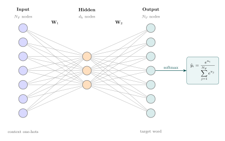

# L9a: Text Embeddings: From Word Counts to Learned Representations
Machine learning models operate on numerical vectors, but natural language is symbolic. To apply machine learning to text, we need to convert words and documents into vectors of numbers. This process is called _text embedding_.

This lecture, which is the first in a series on text embeddings, progresses from count-based methods, Bag of Words (BoW), Term Frequency-Inverse Document Frequency (TF-IDF), and Pointwise Mutual Information (PMI), to the Continuous Bag of Words (CBOW) model, which _learns_ dense embeddings by training a neural network to predict words from context.

> __Learning Objectives:__
> 
> By the end of this lecture, you should be able to:
> 
> * __Bag of Words representation__: Explain how BoW converts text into count vectors over a vocabulary and describe the role of tokenization in building that vocabulary. Identify BoW limitations in dimensionality, context, and semantics.
> * __TF-IDF and PMI weighting__: Compute TF-IDF scores to re-weight raw term counts by penalizing words that appear across many documents. Use PMI to measure word association from co-occurrence probabilities within a fixed context window.
> * __CBOW model and embeddings__: Outline the CBOW architecture as a single hidden layer network trained with cross-entropy loss to predict a target word from context. Describe how word embeddings are extracted from the columns of the input weight matrix after training.

Let's get started!
___

## Examples
Today, we will use the following examples to illustrate key concepts:

> [▶ Let's build a Bag of Words model](CHEME-5820-L9a-Example-BagOfWords-Spring-2026.ipynb). In this example, we build a Bag of Words model to represent text data as vectors of word counts. We also compute TF-IDF and the Pointwise Mutual Information (PMI) matrix to capture word associations for a toy corpus.

> [▶ Let's train a CBOW model](CHEME-5820-L9a-Example-CBOW-Spring-2026.ipynb). In this example, we train a simple Continuous Bag of Words (CBOW) model on a toy corpus, implementing the forward pass and backpropagation manually, and extract the learned word embeddings.
___

## Tokens and Vocabulary
Before we construct embedding vectors, we need to define how text is broken into units and how those units are indexed. This notation is used throughout the lecture.

> Let $\mathcal{V}$ be the vocabulary of tokens (characters, sub-words, whole words, documents, etc.) in our [corpus](https://en.wikipedia.org/wiki/Corpus), and let $N_{\mathcal{V}} = |\mathcal{V}|$ be the vocabulary size. Let $\mathbf{x} = (x_1, x_2, \ldots, x_n)$ with $x_i\in\mathcal{V}$ be a sequence of tokens in the corpus, i.e., a sentence or document, where $n$ is the length of the sequence and $x_i$ is the $i$-th token in the sequence.

Let's consider an example: `My grandma makes the best apple pie.`

Tokens are the units of text that we will be working with. In this setting, tokens can be characters, sub-words, whole words, or documents. Converting a sequence of text into tokens is called _tokenization_.
* __Character-level tokenization__. Given the example above, one possible choice is to let the vocabulary $\mathcal{V}$ be the (English) alphabet (plus punctuation). Thus, we'd get a sequence $\mathbf{x}\in\mathcal{V}$ of length 36: `['M', 'y', ' ' , ..., ' .']`. Character-level tokenization yields sequences of this length in the example.
* __Word-level tokenization__. Another possible choice is to let the vocabulary $\mathcal{V}$ be the set of all words in the corpus (plus punctuation). Thus, we'd get a sequence $\mathbf{x}\in\mathcal{V}$ of length 8: `['My', 'grandma', 'makes', 'the', 'best', 'apple', 'pie', ' .']`. Word-level tokenization uses a vocabulary of words and cannot represent new words at test time.
* __Sub-word tokenization__. A third possible choice is to let the vocabulary $\mathcal{V}$ be the set of word segments like `cious`, `ing`, `pre`. Words like `is` are often a separate token, and single characters are included in the vocabulary $\mathcal{V}$ to ensure all words are expressible.

Given a choice of tokenization/vocabulary, each vocabulary element is assigned an index $k\in\left\{1, 2,\dots,N_{\mathcal{V}},N_{\mathcal{V}}+1,N_{\mathcal{V}}+2,N_{\mathcal{V}}+3,\dots\right\}$ where we've added several control tokens to the vocabulary. For example (there can be more control tokens, depending on the application):
* $\texttt{mask} \rightarrow N_{\mathcal{V}} + 1$: the `mask` token that is used to mask out a token in the input sequence. This is used in training to predict the masked word.
* $\texttt{bos} \rightarrow N_{\mathcal{V}} + 2$: the beginning of the sequence (bos) token is used to indicate the start of a sequence.
* $\texttt{eos} \rightarrow N_{\mathcal{V}} + 3$: the end of sequence (eos) token is used to indicate the end of a sequence.

A piece of text of length $n$ is represented as a sequence of indices (called token IDs) $k_{1}, k_{2}, \ldots, k_{n}$ corresponding to its (sub)words, preceded by the $\texttt{bos}$-token and followed by the $\texttt{eos}$-token. Alternatively, the text can be represented as a sequence of one-hot encoded vectors $\mathbf{x}_{1}, \mathbf{x}_{2}, \ldots, \mathbf{x}_{n}$, where each vector $\mathbf{x}_{j}\in\{0,1\}^{N_{\mathcal{V}}}$ has a 1 in the position corresponding to the token ID $k_{j}$ and 0s elsewhere.

With this notation in hand, we start with the simplest embedding method, the Bag of Words (BoW) representation.

___

## Bag of Words (BoW)
The simplest way to convert text into a numerical vector is to count how often each word appears. The Bag of Words (BoW) model does exactly this: it represents a text (such as a sentence or a document) as a "bag" (multiset) of its words, disregarding grammar and word order but keeping multiplicity.

> __Definition (Bag of Words)__
>
> Let $\mathcal{V}$ be a vocabulary of size $N_{\mathcal{V}}$. The Bag of Words model represents a document as a vector $\mathbf{x} \in \mathbb{R}^{N_{\mathcal{V}}}$, where each element $x_j$ counts the number of times the $j$-th word in $\mathcal{V}$ appears in the document. The resulting vector $\mathbf{x}$ is called the BoW representation of the document.

### Example
Consider the example vocabulary $\mathcal{V}$ derived from the sentence: `My grandma makes the best apple pie.`
Ignoring punctuation and converting to lowercase, our vocabulary is: $\mathcal{V} = \{\text{apple}, \text{best}, \text{grandma}, \text{makes}, \text{my}, \text{pie}, \text{the}\}$ (sorted alphabetically, $N_{\mathcal{V}}=7$).

If we have a document: `The grandma makes the pie.`
The BoW representation would be a vector of counts: $\mathbf{x} = [0, 0, 1, 1, 0, 1, 2]$
corresponding to `[apple, best, grandma, makes, my, pie, the]`. Note that `the` appears twice, so its corresponding entry is 2.

Thus, the BoW model captures word frequency but ignores word order and context. Notice that most entries in the vector are zero, indicating that many words in the vocabulary do not appear in the document, and the order of words is not represented (order does not matter). While BoW converts text into numerical vectors, it has __several limitations:__

> __Limitations of the BoW model__
>
> *   **Dimensionality and sparsity**: For vocabularies with >100k words, the feature vectors have $N_{\mathcal{V}}$ dimensions and many zeros. This increases computational cost and the [curse of dimensionality](https://en.wikipedia.org/wiki/Curse_of_dimensionality), so models need more data to learn patterns.
> *   **Loss of sequence and context**: The BoW model discards word order and grammatical structure. For example, "The dog bit the man" and "The man bit the dog" have identical BoW representations despite having opposite meanings. This limits performance on tasks where context matters.
> *   **Lack of semantic meaning**: The model does not capture semantic similarity between words. In the vector space, `grandma` and `grandmother` are orthogonal (perpendicular) to each other, just as `grandma` and `truck` are. The model does not represent relationships in meaning between words.

BoW also treats all words equally, letting common words like "the" and "is" dominate the counts despite carrying little information. TF-IDF addresses this.
___

## Term Frequency-Inverse Document Frequency (TF-IDF)
In a BoW vector, terms like "the", "is", and "and" accumulate high counts even though they carry little topic information. TF-IDF re-weights the raw counts so that words common across all documents are penalized, while words distinctive to a particular document are emphasized.

> __Definition (TF-IDF)__
>
> Let $\mathcal{D}$ be a corpus of $N$ documents and let $\mathcal{V}$ be the vocabulary. The **TF-IDF** score for a term $t\in\mathcal{V}$ in a document $d\in\mathcal{D}$ is:
> $$\text{TF-IDF}(t, d) = \text{tf}(t, d) \cdot \text{idf}(t, \mathcal{D})$$
> where the **term frequency** $\text{tf}(t, d)$ is the count of term $t$ in document $d$ (often normalized by the total number of words in $d$), and the **inverse document frequency** is:
> $$\text{idf}(t, \mathcal{D}) = \ln\left(\frac{N}{|\{d \in \mathcal{D} : t \in d\}|}\right)$$
> The denominator $|\{d \in \mathcal{D} : t \in d\}|$ is the number of documents in $\mathcal{D}$ that contain term $t$.

The TF-IDF score combines local importance with global distinctiveness.

> __Interpretation__
> 
> * **Large TF-IDF values** indicate that a term is both frequent in the document and rare across other documents. These terms are _distinctive_ to the document and likely carry topic-specific information.
>
> * **Small TF-IDF values** arise in two scenarios: (1) the term appears rarely in the document (low term frequency), or (2) the term appears in many documents across the corpus (high document frequency). Common words like "the", "is", and "and" have small TF-IDF values because they appear in nearly every document, making their idf low.

TF-IDF improves how individual terms are weighted, but it still treats each word independently. It does not capture which words tend to appear together. To measure word associations, we turn to Pointwise Mutual Information (PMI).
___

## Pointwise Mutual Information (PMI)
Both BoW and TF-IDF treat words in isolation. Two words might frequently appear together, like "machine" and "learning", but neither method captures this relationship. PMI measures whether two words co-occur more or less often than we would expect by chance.

> __Definition (Pointwise Mutual Information)__
>
> Let $w$ be a target word and $c$ be a context word. The **PMI** between $w$ and $c$ is:
> $$\text{PMI}(w, c) = \log_2 \frac{P(w, c)}{P(w)\,P(c)}$$
> where $P(w, c)$ is the joint probability of $w$ and $c$ co-occurring within a fixed context window, $P(w) = \sum_{c} P(w,c)$ is the marginal probability of $w$, and $P(c) = \sum_{w} P(w,c)$ is the marginal probability of $c$. In practice, these probabilities are estimated from co-occurrence counts divided by the total number of observed word-context pairs.

The sign of PMI indicates the nature of the association.

> **Interpretation**:
>
>*   **PMI > 0**: The words co-occur more often than expected by chance (association).
>*   **PMI $\approx$ 0**: The words are independent.
>*   **PMI < 0**: The words co-occur less often than expected (complementary distribution).

In practice, we often use **Positive PMI (PPMI)**, which replaces negative values with zero: $\text{PPMI}(w, c) = \max(\text{PMI}(w, c), 0)$.

> __Example__
>
> Let's see BoW, TF-IDF, and PMI in action on a toy corpus.
>
> [▶ Let's build a Bag of Words model](CHEME-5820-L9a-Example-BagOfWords-Spring-2026.ipynb). In this example, we build a Bag of Words model to represent text data as vectors of word counts. We also compute TF-IDF and the Pointwise Mutual Information (PMI) matrix to capture word associations for a toy corpus.

BoW, TF-IDF, and PMI are all count-based methods. They produce sparse, high-dimensional vectors derived from corpus statistics. A different approach is to _learn_ dense, low-dimensional word representations by training a model that predicts words from context.
___

  

    
  

## Continuous Bag of Words (CBOW)
The three methods above all derive representations from corpus statistics. The Continuous Bag of Words (CBOW) model takes a different approach: it trains a neural network to predict a target word from its surrounding context, and the learned weights become the word embeddings. CBOW is described in the [word2vec work](https://arxiv.org/abs/1301.3781).

> __Definition (CBOW)__ 
>
> The Continuous Bag of Words (CBOW) model predicts the probability of a _target word_ based on its surrounding _context words_. The CBOW is encoded as a feedforward neural network with a single hidden layer. The input vector $\mathbf{x}\in\mathbb{R}^{N_{\mathcal{V}}}$ is the sum (or average) of the [one-hot encoded vectors](https://en.wikipedia.org/wiki/One-hot) of the _context words_. The output is a _softmax layer_ that computes the probability of the target word given the context.
> 
> __Reference__: [Rong, X. (2014). word2vec Parameter Learning Explained. ArXiv, abs/1411.2738.](https://arxiv.org/abs/1411.2738)

### Architecture
Let $\mathcal{C}$ be the set of indices of the context words surrounding a target word $w_t$. For a window size of $m$, the context is $\mathcal{C} = \{t-m, \dots, t-1, t+1, \dots, t+m\}$. Let $\mathbf{v}_{w_k} \in \{0,1\}^{N_{\mathcal{V}}}$ be the one-hot encoded vector for context word $w_k$. The input vector $\mathbf{x}$ to the network is the aggregate of the one-hot vectors of the context words:
$$\mathbf{x} = \sum_{k \in \mathcal{C}} \mathbf{v}_{w_k}$$
Alternatively, we can take the average: $\mathbf{x} = \frac{1}{|\mathcal{C}|}\sum_{k \in \mathcal{C}} \mathbf{v}_{w_k}$. This input vector $\mathbf{x}\in\mathbb{R}^{N_{\mathcal{V}}}$ is connected to a hidden layer $\mathbf{h}\in\mathbb{R}^{d_h}$ which is computed using a linear identity transformation, i.e., with no activation function:
$$\mathbf{h} = \mathbf{W}_{1}\,\mathbf{x}$$
where $\mathbf{W}_{1}\in\mathbb{R}^{d_h\times{N_{\mathcal{V}}}}$ is the weight matrix of the hidden layer and $d_h$ is the embedding dimension. The hidden layer is then mapped through another linear layer:
$$\mathbf{u} = \mathbf{W}_{2}\,\mathbf{h}$$
which produces the $\mathbf{u}\in\mathbb{R}^{N_{\mathcal{V}}}$ vector, where $\mathbf{W}_{2}\in\mathbb{R}^{N_{\mathcal{V}}\times{d_h}}$ is the weight matrix for the output layer. Let $\mathbf{w}_{2}^{(i)}$ denote the $i$-th row of $\mathbf{W}_{2}$, so $u_i = \langle \mathbf{w}_{2}^{(i)}, \mathbf{h}\rangle$. The output layer is then passed through a softmax activation function to obtain the probability distribution over the vocabulary:
$$p(w_{i} | \mathbf{x}) = \hat{y}_i = \frac{e^{u_i}}{\sum_{j=1}^{N_{\mathcal{V}}} e^{u_j}}$$
where $\hat{y}_i$ is the predicted probability of observing the $i$-th token in the vocabulary as the target, given the context vector $\mathbf{x}$.

> __Definition (CBOW Model):__
>
> Let $\mathcal{V}$ be a vocabulary of size $N_{\mathcal{V}}$, let $d_h \in \mathbb{Z}_{>0}$ be the embedding dimension, and let $\mathcal{C}$ be the context index set (defined above). Let $\mathbf{v}_{w_k} \in \{0,1\}^{N_{\mathcal{V}}}$ be the one-hot vector for context word $w_k$. The CBOW model is defined by the following forward pass:
>
> $$\mathbf{x} = \sum_{k \in \mathcal{C}} \mathbf{v}_{w_k} \in \mathbb{R}^{N_{\mathcal{V}}}$$
>
> $$\mathbf{h} = \mathbf{W}_{1}\,\mathbf{x} \in \mathbb{R}^{d_h}$$
>
> $$\mathbf{u} = \mathbf{W}_{2}\,\mathbf{h} \in \mathbb{R}^{N_{\mathcal{V}}}$$
>
> $$\hat{y}_i = \frac{e^{u_i}}{\displaystyle\sum_{j=1}^{N_{\mathcal{V}}} e^{u_j}}, \quad i = 1,\dots,N_{\mathcal{V}}$$
>
> where $\mathbf{W}_{1} \in \mathbb{R}^{d_h \times N_{\mathcal{V}}}$ and $\mathbf{W}_{2} \in \mathbb{R}^{N_{\mathcal{V}} \times d_h}$ are learned weight matrices. Let $\mathbf{y} \in \{0,1\}^{N_{\mathcal{V}}}$ be the one-hot vector of the target word. The model is trained by minimizing the cross-entropy loss:
>
> $$\mathcal{L} = -\sum_{i=1}^{N_{\mathcal{V}}} y_i \log \hat{y}_i$$
>
> After training, the word embedding for the $i$-th vocabulary word is the $i$-th column of $\mathbf{W}_{1}$, i.e., $\mathbf{W}_{1}[:,i] \in \mathbb{R}^{d_h}$.

The linear hidden layer is central to how CBOW achieves efficient embedding.

> __Why no activation function?__
>
> The hidden layer uses a linear map. This reduces computation and matches the linear structure of the embedding space.
> *   **Computation**: Removing the non-linearity reduces cost and supports training on corpora with billions of words.
> *   **Linear map**: The linear projection preserves linear relationships in the embedding space, enabling vector arithmetic like $\texttt{vector}(\text{King}) - \texttt{vector}(\text{Man}) + \texttt{vector}(\text{Woman}) \approx \texttt{vector}(\text{Queen})$.
>
> This supports embedding learning but limits nonlinear patterns that networks with more layers can capture.

### Training
The training objective of the CBOW model is to _maximize_ the likelihood of the target word given the context words. This is done by _minimizing_ the __negative log-likelihood loss function__ (cross-entropy loss) for one training example. Let $\mathbf{y}\in\{0,1\}^{N_{\mathcal{V}}}$ be the one-hot encoded vector of the target word, where $y_i = 1$ if the $i$-th word in $\mathcal{V}$ is the target and $y_i = 0$ otherwise. The loss function is defined as:
$$
\begin{align*}
\mathcal{L} &= -\sum_{i=1}^{N_{\mathcal{V}}} y_{i}\,\log \hat{y}_i \\
&= -\sum_{i=1}^{N_{\mathcal{V}}} y_{i}\,\log \left( \frac{e^{u_i}}{\sum_{j=1}^{N_{\mathcal{V}}} e^{u_j}} \right) \\
&= -\sum_{i=1}^{N_{\mathcal{V}}} y_{i}\,\left( u_i - \log \left( \sum_{j=1}^{N_{\mathcal{V}}} e^{u_j} \right) \right) \\
&= \sum_{i=1}^{N_{\mathcal{V}}} y_{i}\,\left(\log \left( \sum_{j=1}^{N_{\mathcal{V}}} e^{u_j} \right) - u_i\right) \\
&= \sum_{i=1}^{N_{\mathcal{V}}} y_{i}\,\left(\log \left( \sum_{j=1}^{N_{\mathcal{V}}} e^{\langle \mathbf{w}_{2}^{(j)},\mathbf{W}_{1}\,\mathbf{x}\rangle} \right) - \langle \mathbf{w}_{2}^{(i)},\mathbf{W}_{1}\,\mathbf{x}\rangle\right)\quad\text{substitute}~u_{i} = \langle \mathbf{w}_{2}^{(i)},\mathbf{W}_{1}\,\mathbf{x}\rangle\;\blacksquare\\
\end{align*}
$$
where $\mathcal{L}$ is the loss function, and $\langle \cdot,\cdot\rangle$ is the inner product.

The loss $\mathcal{L}$ is minimized with respect to $\mathbf{W}_{1}$ and $\mathbf{W}_{2}$ using __stochastic gradient descent (SGD)__. For each training pair $(\mathbf{x}, \mathbf{y})$, the gradients $\partial\mathcal{L}/\partial\mathbf{W}_{2}$ and $\partial\mathcal{L}/\partial\mathbf{W}_{1}$ are computed via backpropagation, and the weights are updated as:
$$
\mathbf{W}_{1} \leftarrow \mathbf{W}_{1} - \eta\,\frac{\partial\mathcal{L}}{\partial\mathbf{W}_{1}}, \qquad \mathbf{W}_{2} \leftarrow \mathbf{W}_{2} - \eta\,\frac{\partial\mathcal{L}}{\partial\mathbf{W}_{2}}
$$
where $\eta > 0$ is the learning rate. Training iterates over all (context, target) pairs for multiple passes (epochs) until the loss converges. For more details on stochastic gradient descent and backpropagation: [see the advanced derivation notebook](CHEME-5820-L9a-Advanced-CBOW-SGD-Spring-2026.ipynb)

### Extracting the Embeddings
Once the model is trained, we are not interested in the prediction task itself. Instead, our goal is the weight matrix $\mathbf{W}_{1}$.

> __Definition (Word Embeddings from CBOW)__
>
> The columns of the weight matrix $\mathbf{W}_{1} \in \mathbb{R}^{d_h \times N_{\mathcal{V}}}$ constitute the **word embeddings**. Each column $i$ corresponds to the $d_h$-dimensional vector representation of the $i$-th word in the vocabulary. To get the embedding for a specific word, we look up the corresponding column in $\mathbf{W}_{1}$. This layer is called the **Lookup Table**.

### Practical Note: The Softmax Bottleneck
In the derivation above, the denominator of the softmax function requires summing over the entire vocabulary size $N_{\mathcal{V}}$:
$$\sum_{j=1}^{N_{\mathcal{V}}} e^{u_j}$$
For vocabularies with $N_{\mathcal{V}} \approx 1,000,000$, computing this sum for every training example is a bottleneck. Implementations (like the original Word2Vec C code or Gensim) use approximation techniques such as **Negative Sampling** or **Hierarchical Softmax** to approximate the denominator without summing over all words.

> __Example__
>
> Let's see CBOW in action on our toy corpus.
>
> [▶ Let's train a CBOW model](CHEME-5820-L9a-Example-CBOW-Spring-2026.ipynb). In this example, we train a simple Continuous Bag of Words (CBOW) model on a toy corpus, implementing the forward pass and backpropagation manually, and extract the learned word embeddings.

___

## Summary
This lecture traced a progression from count-based methods — Bag of Words, TF-IDF, and PMI — to the prediction-based CBOW model that learns dense word embeddings.

> __Key Takeaways:__
> 
> * __BoW and TF-IDF__: BoW represents documents as word count vectors, but common words dominate the counts. TF-IDF addresses this by re-weighting terms based on document frequency, emphasizing words that are distinctive to specific documents.
> * __PMI for associations__: PMI compares observed co-occurrence probability to the expected probability under independence. Positive values indicate words that co-occur more than expected, while negative values indicate avoidance.
> * __CBOW embeddings__: CBOW predicts a target word from surrounding context words using a single hidden layer with no activation function. After training, the columns of the input weight matrix serve as dense word embedding vectors.

These count-based and prediction-based methods form the foundation for more advanced embedding techniques such as GloVe and contextual embeddings.

___

Sources for this lecture:
* [Mikolov, T., Chen, K., Corrado, G., & Dean, J. (2013). Efficient Estimation of Word Representations in Vector Space. ArXiv, abs/1301.3781.](https://arxiv.org/abs/1301.3781)
* [Rong, X. (2014). word2vec Parameter Learning Explained. ArXiv, abs/1411.2738.](https://arxiv.org/abs/1411.2738)
* [Jurafsky, D., & Martin, J. H. (2024). Speech and Language Processing, Chapter 6: Vector Semantics and Embeddings.](https://web.stanford.edu/~jurafsky/slp3/)

___
