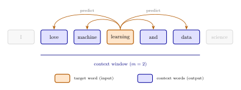

# L9c: The Skip-Gram Model for Word Embeddings
In the previous lecture, we introduced the Continuous Bag of Words (CBOW) model, which predicts a target word from its surrounding context. CBOW works well for frequent words, but each word occurrence produces only one gradient update, limiting its ability to learn representations for rare words.

The Skip-Gram model reverses the prediction task: given a single target word, it predicts each surrounding context word. This generates multiple training examples per word occurrence, producing better embeddings for infrequent words. However, the expanded prediction task increases computational cost. To address this, we introduce Negative Sampling, which replaces the full softmax with a binary classification objective.

> __Learning Objectives:__
> 
> By the end of this lecture, you should be able to:
> 
> * __Skip-Gram architecture__: Describe the Skip-Gram network structure and how it differs from CBOW by predicting context words from a single target word. Explain why this reversal generates more training signal per word occurrence.
> * __Negative Sampling__: Explain why the full softmax is a computational bottleneck for large vocabularies. Describe how Negative Sampling replaces softmax with a binary classification task using randomly sampled negative examples.
> * __Embedding extraction__: Identify where word embeddings are stored in the trained Skip-Gram model. Explain why Skip-Gram produces better representations for rare words compared to CBOW.

Let's get started!
___

## Examples
Today, we will use the following examples to illustrate key concepts:

> [▶ Let's build a Skip-Gram model](CHEME-5820-L9c-Example-SkipGram-Spring-2026.ipynb). In this example, we train a Skip-Gram model on a toy corpus using both full softmax and Negative Sampling, compare the training dynamics, and evaluate the learned embeddings against the CBOW embeddings from L9a.
___

  

    
  

## Skip-Gram Model
CBOW takes multiple context words as input and predicts one target word. Skip-Gram flips this: it takes one target word as input and predicts each context word separately.

> __Definition (Skip-Gram)__
>
> The Skip-Gram model uses a feedforward network with one hidden layer to predict context word probabilities given a target word. The input is the [one-hot encoded vector](https://en.wikipedia.org/wiki/One-hot) of the target word, and the output produces a probability distribution over the vocabulary for each context position within a sliding window.
> 
> __Reference__: [Mikolov, T., et al. (2013). Efficient Estimation of Word Representations in Vector Space. ArXiv, abs/1301.3781.](https://arxiv.org/abs/1301.3781)

### Architecture
Let $w_t$ be the target word at position $t$ in a sentence. For a window size of $m$, the context positions are $\mathcal{C} = \{t-m, \dots, t-1, t+1, \dots, t+m\}$. Let $\mathbf{v}_{w_t} \in \{0,1\}^{N_{\mathcal{V}}}$ be the one-hot encoded vector for the target word.

The input $\mathbf{x} = \mathbf{v}_{w_t}$ connects to a hidden layer $\mathbf{h}\in\mathbb{R}^{d_h}$ via a linear transformation:
$$
\mathbf{h} = \mathbf{W}_{1} \cdot \mathbf{x}
$$
where $\mathbf{W}_{1}\in\mathbb{R}^{d_h\times{N_{\mathcal{V}}}}$ is the input weight matrix and $d_h$ is the embedding dimension. Since $\mathbf{x}$ is one-hot, this multiplication selects the column of $\mathbf{W}_{1}$ corresponding to word $w_t$. The hidden layer maps to the output:
$$
\mathbf{u} = \mathbf{W}_{2} \cdot \mathbf{h}
$$
where $\mathbf{W}_{2}\in\mathbb{R}^{N_{\mathcal{V}}\times{d_h}}$ is the output weight matrix. For each context position $c \in \mathcal{C}$, the model predicts a probability distribution over the vocabulary using softmax:
$$
p(w_{c} = w_{i} \mid w_t) = \hat{y}_{i} = \frac{e^{u_i}}{\sum_{j=1}^{N_{\mathcal{V}}} e^{u_j}}
$$
where $u_i$ is the $i$-th element of $\mathbf{u}$ and $\hat{y}_{i}$ is the predicted probability that word $w_i$ appears in the context of target $w_t$.

> __Definition (Skip-Gram Model):__
>
> Let $\mathcal{V}$ be a vocabulary of size $N_{\mathcal{V}}$, $d_h \in \mathbb{Z}_{>0}$ the embedding dimension, and $\mathcal{C}$ the context index set around the target position. The Skip-Gram forward pass proceeds in __four steps__:
>
> 1. The target word is represented as a one-hot vector: $\mathbf{x} = \mathbf{v}_{w_t} \in \{0,1\}^{N_{\mathcal{V}}}$.
> 2. The one-hot input is projected into the embedding space through a linear hidden layer with no activation: $\mathbf{h} = \mathbf{W}_{1}\,\mathbf{x} \in \mathbb{R}^{d_h}$, where $\mathbf{W}_{1} \in \mathbb{R}^{d_h \times N_{\mathcal{V}}}$. Since $\mathbf{x}$ is one-hot, this selects the column of $\mathbf{W}_{1}$ for word $w_t$.
> 3. The hidden representation is mapped to output logits $\mathbf{u} = \mathbf{W}_{2}\,\mathbf{h} \in \mathbb{R}^{N_{\mathcal{V}}}$, where $\mathbf{W}_{2} \in \mathbb{R}^{N_{\mathcal{V}} \times d_h}$.
> 4. The logits are normalized by softmax to give a predicted probability for each vocabulary word at each context position $c \in \mathcal{C}$:
> $$\hat{y}_i = \frac{e^{u_i}}{\displaystyle\sum_{j=1}^{N_{\mathcal{V}}} e^{u_j}}, \quad i = 1,\dots,N_{\mathcal{V}}$$
> The model is trained by minimizing the cross-entropy loss summed over all context positions: $\mathcal{L} = -\sum_{c \in \mathcal{C}} \sum_{i=1}^{N_{\mathcal{V}}} y_{c,i} \log \hat{y}_i$, where $\mathbf{y}_{c} \in \{0,1\}^{N_{\mathcal{V}}}$ is the one-hot vector of the context word at position $c$. After training, the columns of $\mathbf{W}_{1} \in \mathbb{R}^{d_h \times N_{\mathcal{V}}}$ are the learned word embeddings.

The architecture is identical to CBOW in structure (two weight matrices, one hidden layer, softmax output), but the roles of input and output are reversed.

> __Key Difference from CBOW__
>
> * **CBOW**: Many context words as input, one target word as output (many-to-one).
> * **Skip-Gram**: One target word as input, many context words as output (one-to-many).
>
> Skip-Gram generates $2m$ predictions per training example (one per context position). Each occurrence of a rare word produces $2m$ gradient updates to its embedding, compared to CBOW's single update. This makes Skip-Gram more expensive but better for rare words.

### Training Objective
The training objective maximizes the probability of the actual context words given the target. Let $\mathbf{y}_{c}\in\{0,1\}^{N_{\mathcal{V}}}$ be the one-hot vector for the actual context word at position $c$. Assuming context words are conditionally independent given the target, the loss for one training example is:
$$
\begin{align*}
\mathcal{L} &= -\sum_{c \in \mathcal{C}} \log p(w_c \mid w_t) \\
&= -\sum_{c \in \mathcal{C}} \log \frac{e^{u_{w_c}}}{\sum_{j=1}^{N_{\mathcal{V}}} e^{u_j}} \\
&= \sum_{c \in \mathcal{C}} \left( \log \sum_{j=1}^{N_{\mathcal{V}}} e^{u_j} - u_{w_c} \right) \\
&= |\mathcal{C}| \cdot \log \sum_{j=1}^{N_{\mathcal{V}}} e^{u_j} - \sum_{c \in \mathcal{C}} u_{w_c} \quad\blacksquare
\end{align*}
$$
where $u_{w_c}$ is the element of $\mathbf{u}$ corresponding to the actual context word at position $c$, and $|\mathcal{C}| = 2m$. The softmax normalization $\log \sum_{j} e^{u_j}$ appears $2m$ times, making this expensive for large vocabularies.

The model is trained using gradient descent on $\mathbf{W}_1$ and $\mathbf{W}_2$. For the full gradient derivation and optimization algorithms (AdaGrad, Adam), see [▶ Advanced: Gradient Descent Algorithms for Skip-Gram](CHEME-5820-L9c-Advanced-SkipGram-GD-Algorithm-Spring-2026.ipynb).

### Extracting the Embeddings
As with CBOW, the prediction task is a means to an end. After training, we extract the word embeddings from the weight matrices.

> __Definition (Skip-Gram Embeddings)__
>
> The columns of $\mathbf{W}_{1} \in \mathbb{R}^{d_h \times N_{\mathcal{V}}}$ are the **input embeddings** and the rows of $\mathbf{W}_{2} \in \mathbb{R}^{N_{\mathcal{V}} \times d_h}$ are the **output embeddings**. In practice, either $\mathbf{W}_{1}$ or the average of both matrices is used as the final word embedding.

___

## Negative Sampling
The softmax denominator $\sum_{j=1}^{N_{\mathcal{V}}} e^{u_j}$ sums over all vocabulary words, and this sum is computed $2m$ times per training example. For large vocabularies ($N_{\mathcal{V}} \approx 10^6$), this becomes prohibitive. Negative Sampling replaces the full softmax with a binary classification task: distinguish actual context words (positive examples) from randomly sampled words (negative examples).

> __Definition (Negative Sampling)__
>
> For a target word $w_t$ with hidden representation $\mathbf{h} = \mathbf{W}_{1} \cdot \mathbf{v}_{w_t}$ and a context word $w_c$, let $\mathbf{w}_{c}^{(2)}$ be the output embedding for $w_c$ (the corresponding row of $\mathbf{W}_2$). The Negative Sampling objective for one (target, context) pair is:
> $$
> \mathcal{L}_c = -\log \sigma\!\left((\mathbf{w}_{c}^{(2)})^{\top} \mathbf{h}\right) - \sum_{i=1}^{k} \log \sigma\!\left(-(\mathbf{w}_{n_i}^{(2)})^{\top} \mathbf{h}\right)
> $$
> where $\sigma(x) = 1/(1+e^{-x})$ is the sigmoid function, $k$ is the number of negative samples (typically 5 to 20), and $\{w_{n_1}, \dots, w_{n_k}\}$ are words drawn from a noise distribution $P_n(w) \propto f(w)^{3/4}$ where $f(w)$ is the word frequency in the corpus.

This reduces per-example complexity from $O(N_{\mathcal{V}})$ to $O(k)$. The first term pushes the dot product $(\mathbf{w}_{c}^{(2)})^{\top}\mathbf{h}$ higher for actual context words. The second term pushes the dot product lower for randomly sampled words. Together, they train the model to place co-occurring words closer in the embedding space.

Negative Sampling also has a connection to the count-based methods from the previous lecture.

> __Theoretical Connection to PMI__
>
> [Levy and Goldberg (2014)](https://papers.nips.cc/paper/2014/hash/feab05aa91085b7a8012516bc3533958-Abstract.html) showed that Skip-Gram with Negative Sampling (SGNS), when trained to convergence, implicitly factorizes a shifted Pointwise Mutual Information (PMI) matrix:
> $$
> \mathbf{W}_{1}^{\top} \mathbf{W}_{2} \approx \text{PMI}(w, c) - \log k
> $$
> where $k$ is the number of negative samples. This result connects the prediction-based Skip-Gram approach to the count-based PMI method discussed in L9a.

Let's see Skip-Gram and Negative Sampling in action.

> [▶ Let's build a Skip-Gram model](CHEME-5820-L9c-Example-SkipGram-Spring-2026.ipynb). In this example, we train a Skip-Gram model on a toy corpus using both full softmax and Negative Sampling, compare the training dynamics, and evaluate the learned embeddings against the CBOW embeddings from L9a.

___

## Practical Considerations
Several hyperparameters control Skip-Gram's behavior. The window size ($m = 5$ to $10$) determines the range of context: smaller windows capture syntactic patterns, while larger windows capture semantic relationships. The embedding dimension ($d_h = 100$ to $300$) balances expressiveness against data requirements. The number of negative samples ($k = 5$ to $20$) trades embedding quality for training speed.

When choosing between CBOW and Skip-Gram, the decision depends on the corpus and the task.

> __CBOW vs Skip-Gram__
>
> * **CBOW** is faster to train and works well when the corpus is large and frequent words are the primary concern.
> * **Skip-Gram** produces better embeddings for rare words because each word occurrence generates $2m$ gradient updates instead of one. It is preferred when the corpus is smaller or rare word quality matters.

Pre-trained embeddings such as Word2Vec (Google News), GloVe (Common Crawl), and FastText (with subword information) are available for general-purpose use. For small corpora (fewer than 10 million words) or general-domain tasks, pre-trained embeddings are a practical starting point. For large, domain-specific corpora (medical, legal, technical), training from scratch can yield better results.
___

## Lab
In the lab, we will implement a Skip-Gram model with Negative Sampling from scratch and compare it to the CBOW model from L9a. We will train both models on a toy corpus, visualize the learned embeddings, and evaluate their performance on word similarity tasks.

## Summary
This lecture introduced the Skip-Gram model, which reverses the CBOW prediction task to learn word embeddings by predicting context words from a target word, and Negative Sampling, which makes training practical for large vocabularies.

> __Key Takeaways__:
>
> * __Skip-Gram architecture__: Skip-Gram reverses CBOW by predicting multiple context words from a single target word, producing multiple training signals per word occurrence. This provides more gradient updates for rare words, yielding better embeddings for infrequent terms.
> * __Negative Sampling__: The full softmax requires summing over the entire vocabulary for each context prediction, which is prohibitive for large vocabularies. Negative Sampling replaces this with a binary classification task using a small number of randomly sampled negative examples, reducing the per-example cost from linear in vocabulary size to linear in the number of negative samples.
> * __Connection to count-based methods__: Skip-Gram with Negative Sampling implicitly factorizes a shifted PMI matrix, connecting prediction-based and count-based embedding approaches. In practice, either the input weight matrix columns or the average of both weight matrices serves as the final word embedding.

These prediction-based methods, together with the count-based approaches from L9a, provide the foundation for modern word representation techniques.

___

Sources for this lecture:
* [Mikolov, T., Chen, K., Corrado, G., & Dean, J. (2013). Efficient Estimation of Word Representations in Vector Space. ArXiv, abs/1301.3781.](https://arxiv.org/abs/1301.3781)
* [Mikolov, T., Sutskever, I., Chen, K., Corrado, G., & Dean, J. (2013). Distributed Representations of Words and Phrases and their Compositionality. NeurIPS 2013.](https://arxiv.org/abs/1310.4546)
* [Levy, O., & Goldberg, Y. (2014). Neural Word Embedding as Implicit Matrix Factorization. NeurIPS 2014.](https://papers.nips.cc/paper/2014/hash/feab05aa91085b7a8012516bc3533958-Abstract.html)
* [Rong, X. (2014). word2vec Parameter Learning Explained. ArXiv, abs/1411.2738.](https://arxiv.org/abs/1411.2738)

___
